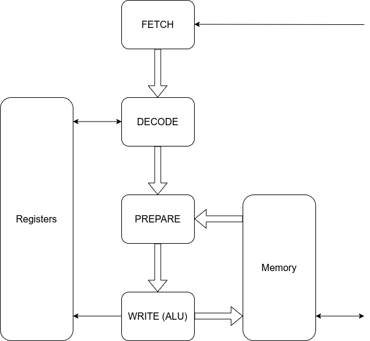

# A pipelined implementation of the QNICE CPU

This version of the QNICE CPU (from the QNICE-FPGA project) is not a drop-in
replacement, for the following two reasons:
   * This design uses the Wishbone memory bus
   * This design uses separate instruction and data interfaces.
However, it should be a simple operation to modify the QNICE-FPGA project to
support this implementation.

## Architecture

This is essentially a three-stage pipeline consisting of:

* Fetch
* Decode
* Execute

See the following block diagram:



## Interface
From the Fetch to the Decode modules we have the following signals:

```
valid_i   : in  std_logic;
ready_o   : out std_logic;
double_i  : in  std_logic;
addr_i    : in  std_logic_vector(15 downto 0);
data_i    : in  std_logic_vector(31 downto 0);
double_o  : out std_logic;
```

Here `valid_i` and `ready_o` are the usual handshaking signals, `addr_i` is the
address of the current instruction, and `data_i` contains one or two words of
data, as indicated by the signal `double_i`. In either case `data_i(15 downto
0)` is the instruction, and `data_i(31 downto 16)` is the immediate operand if
present.

In conjunction with the `ready_o` signal, the signal `double_o` indicates
whether one or two words are consumed in this clock cycle. Therefore, this
signal must depend combinatorially on the input signals.

## Instruction decoding

The overall idea of this implementation is to convert each instruction into a
sequence of micro-operations:
* Read from memory to source operand buffer
* Read from memory to destination operand buffer
* Write to memory
* Write to register

The reason is that e.g. the instruction `ADD @R0, @R1` performs two memory
reads (from `@R0` and `@R1`) and one memory write (to `@R1`). Since only one
memory operation is possible in each clock cycle, such an instruction will
need to be serialized and will take a total of three clock cycles.

The first step in the instruction decoding is to categorize the instuction
depending on:
* Is source operand valid?
* Is destination operand valid?
* Is the source operand an immediate value, i.e. `@PC++`?
* Is the destination operand an immediate value, i.e. `@PC++`?
* Does instruction read from destination operand?
* Does instruction write to destination operand?
* Does source operand involve memory?
* Does destination operand involve memory?

Based on the above, the Decode module generates a list of up to three microcode
instructions.

The table above is implemented as a logic table where the index is calculated
from the following four bits:

* Does instruction read from destination operand?
* Does instruction write to destination operand?
* Does source operand involve memory?
* Does destination operand involve memory?


Below are some examples of instruction decodings.  In the table below I use the
following abreviations:
* `MRS` : Read from memory to source operand buffer
* `MRD` : Read from memory to destination operand buffer
* `MW`  : Write to memory
* `RW`  : Write to register

```
               | MRS | MRD |  MW |  RW |
               +-----+-----+-----+-----+
MOVE R, R      |  .  |  .  |  .  |  X  |
               |-----|-----+-----+-----+
MOVE R, @R     |  .  |  .  |  X  |  .  |
               |-----|-----+-----+-----+
MOVE @R, R     |  X  |  .  |  .  |  .  |
               |  .  |  .  |  .  |  X  |
               |-----|-----+-----+-----+
MOVE @R, @R    |  X  |  .  |  .  |  .  |
               |  .  |  .  |  X  |  .  |
               +-----+-----+-----+-----+

               | MRS | MRD |  MW |  RW |
               +-----+-----+-----+-----+
CMP R, R       |  .  |  .  |  .  |  .  |
               |-----|-----+-----+-----+
CMP R, @R      |  .  |  X  |  .  |  .  |
               |  .  |  .  |  .  |  .  |
               |-----|-----+-----+-----+
CMP @R, R      |  X  |  .  |  .  |  .  |
               |  .  |  .  |  .  |  .  |
               |-----|-----+-----+-----+
CMP @R, @R     |  X  |  .  |  .  |  .  |
               |  .  |  X  |  .  |  .  |
               |-----|-----+-----+-----+

               | MRS | MRD |  MW |  RW |
               +-----+-----+-----+-----+
ADD R, R       |  .  |  .  |  .  |  X  |
               |-----|-----+-----+-----+
ADD R, @R      |  .  |  X  |  .  |  .  |
               |  .  |  .  |  X  |  .  |
               |-----|-----+-----+-----+
ADD @R, R      |  X  |  .  |  .  |  .  |
               |  .  |  .  |  .  |  X  |
               |-----|-----+-----+-----+
ADD @R, @R     |  X  |  .  |  .  |  .  |
               |  .  |  X  |  .  |  .  |
               |  .  |  .  |  X  |  .  |
               +-----+-----+-----+-----+

               | MRS | MRD |  MW |  RW |
               +-----+-----+-----+-----+
JMP R          |  .  |  .  |  .  |  .  |
               |-----|-----+-----+-----+
JMP @R         |  X  |  .  |  .  |  .  |
               |  .  |  .  |  .  |  .  |
               |-----|-----+-----+-----+
ASUB R         |  .  |  .  |  X  |  .  |
               |-----|-----+-----+-----+
ASUB @R        |  X  |  .  |  .  |  .  |
               |  .  |  .  |  X  |  .  |
               |-----|-----+-----+-----+
```

One thing to note in the above is that `MW` and `RW` are never true in the same
clock cycle.

To the Execute module we have a number of signals for each clock cycle:
* `MRS` : Read from memory and store in source buffer
* `MRD` : Read from memory and store in destination buffer
* `MW`  : Write to memory
* `RW`  : Write to register

The above signals are copied three times for the up to three clock cycles an
instruction make take.

Then there are some additional signals
* `OPER`     : ALU operation. This is almost identical to the instruction opcode.
* `SRC_REG`  : Source register number
* `SRC_MODE` : Source mode
* `SRC_VAL`  : Source register value
* `DST_REG`  : Destination register number
* `DST_MODE` : Destination mode
* `DST_VAL`  : Destination register value


## TODO
* Cleanup code.
* Formal verification.
* Cycle Optimizations (see below).
* Add interrupts.
* Timing optimizations.


## Cycle Optimizations:
1. Let the FETCH module present two (or three) words to the DECODE module, so the latter doesn't have to wait.
2. Eliminate the NOP cycle from the CMP @R1, @PC++ instruction.
3. Optimize conditional jumps, so they don't execute superfluous microoperations.
4. Optimize FETCH module. It currently takes three clock cycles after a jump. This could be reduced to one clock cycle.


## Vivado Synthesis
```
Slice LUTs      : 921
Slice Registers : 327
Slices          : 296
Block RAMs      : 2
```

```
Number of cells:               5813
  $assert                         1
  BUFG                            1
  CARRY4                         36
  FDRE                          358
  FDSE                            2
  IBUF                            2
  INV                            96
  LUT1                           69
  LUT2                          243
  LUT3                          245
  LUT4                          220
  LUT5                          557
  LUT6                         1226
  MUXF7                        1024
  MUXF8                         173
  OBUF                           16
  RAM128X1D                    1024
  RAM32M                          8
  RAM64M                        512

Estimated number of LCs:       2248
```

