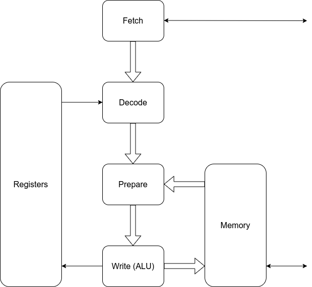

# A pipelined implementation of the QNICE CPU

## Architecture
This implementation is essentially a four-stage pipeline consisting of:

* FETCH: Fetches from the instruction memory and presents up to two words at a
  time to the DECODE stage.
* DECODE: Outputs a sequence of single micro-operations to the EXECUTE stage.
* PREPARE: Prepares the input operands for the ALU.
* WRITE: Contains the ALU and performs write-back of the result to register and/or memory.

See the following block diagram:



The block diagram contains two additional blocks:
* REGISTERS: Contains all the CPU registers and supports two read ports and one
  write port.
* MEMORY: Interfaces to the Wishbone memory bus and supports two read ports and
  one write port.

The flow through the pipeline is that an instruction will spend one or two
clock cycles in the FETCH stage (two cycles if it uses an immediate operand),
and up to three clock cycles in the DECODE stage. The EXECUTE stage is purely
combinatorial.


## Detailed design description
For more detailed information about the design look here:
* [FETCH](../src/fetch/README.md)
* [DECODE](../src/decode/README.md)
* [EXECUTE](../src/execute/README.md)
* [REGISTERS](../src/registers/README.md)
* [MEMORY](../src/memory/README.md)


## Wishbone
I think it's worh while to give here a short summary of the Wishbone protocol.
Any wishbone slave (e.g. the memory) must have the following signals.
```
wb_cyc_i   : out std_logic;
wb_stb_i   : out std_logic;
wb_stall_o : in  std_logic;
wb_addr_i  : out std_logic_vector(15 downto 0);
wb_we_i    : out std_logic;
wb_data_i  : out std_logic_vector(15 downto 0);
wb_ack_o   : in  std_logic;
wb_data_o  : in  std_logic_vector(15 downto 0)
```

A write transaction is indicated by the CPU asserting all three signals
`wb_cyc_i`, `wb_stb_i`, and `wb_we_i` simultaneously together with the address
and data signals `wb_addr_i` and `wb_data_i`. The signal `wb_stall_o` is used
to indicate the end of the transaction. When `wb_stall_o` the slave has accepted
the transaction.

A write transaction is indicated by the CPU asserting the two signals
`wb_cyc_i` and `wb_stb_i`, and de-asserting `wb_we_i`. Again the signal
`wb_stall_o` is used to indicate the end of the transaction. When `wb_stall_o`
the slave has accepted the transaction.  When the data is ready, the slave
drives the data but `wb_data_o` and asserts the signal `wb_ack_o`.


## Interleaving
Analyzing the timing of a QNICE assembly program is not simple, due to the
pipeline architecture. Some instructions - like `MOVE 0x0000, R0` - are limited
by the bandwidth of the instruction memory, while other instructions - like
`MOVE @R0, @R1` - are limited by the bandwidth of the data memory.

What this means is that the instruction `MOVE 0x0000, R0` needs only one clock
cycle to execute, but it needs two clock cycles to read the instruction and
immediate operand from the instruction memory. On the other hand the
instruction `MOVE @R0, @R1` needs only one clock cycle to read from instruction
memory, but needs at least two clock cycles to execute.

In the file [`test/prog_interleave.asm`](../test/prog_interleave.asm) I conduct a
small experiment, where I first have a sequence of identical instructions `MOVE
0x0000, R0` that each take two clock cycles, then a sequence of identical
instructions `MOVE @R0, @R1` that again take two clock cycles each. The final
part contains alternating instructions `MOVE 0x0000, R0` and `MOVE @R0, @R1`,
and this sequence of two instructions take a total of three instructions to
execute. So the pair of instructions are faster than the sum of each individual
instruction, because the instruction and data memories are operating
simultaneously.


## Optimizations
I have a few ideas for cycle optimizations at the moment:
* Make the fetch module not clear `wbi_cyc_o` at every branch. This will reduce
  the branch penalty by one clock cycle.


## TODO
* Add remaining formal verification.
* Add interrupts.


## Utilization

The current synthesis report shows the following utilization:

|   Name    | LUTs | Regs | Slices |
| --------- | ---- | ---- | ------ |
| Fetch     |   67 |  152 |    42  |
| Decode    |   73 |   76 |    40  |
| Execute   |  494 |    0 |   179  |
| Registers |  105 |  142 |    54  |
| Memory    |   43 |   37 |    32  |
| TOTAL     |  782 |  407 |   267  |


