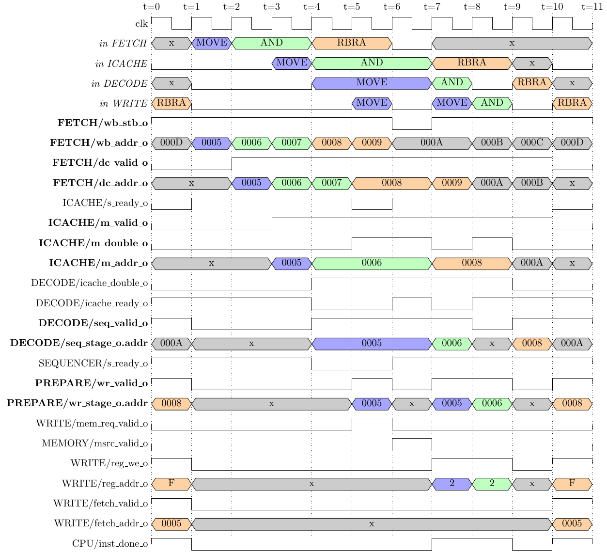

# A pipelined implementation of the QNICE CPU

## Architecture
This implementation is a four-stage pipeline — FETCH, DECODE, PREPARE, WRITE —
with two further blocks sitting on the links between them. Six blocks in
pipeline order:

* FETCH: Fetches one word from the instruction memory.
* ICACHE: Presents up to two words (instruction plus immediate operand) at a
  time to DECODE.
* DECODE: Translates the instruction into a list of up to three
  micro-operations, and reads the operand registers.
* SEQUENCER: Forwards one micro-operation at a time to PREPARE. Not a stage of
  its own: it holds no payload registers and adds no latency.
* PREPARE: Prepares the input operands for the ALU.
* WRITE: Contains the ALU and performs write-back of the result to register
  and/or memory.

See the following block diagram:


It is drawn by [cpu.tex](cpu.tex) and rendered by `make diagrams`; edit the LaTeX
source rather than the `.png`.

The dotted outline in the diagram is CPU_MAIN, which exists mainly to give the
formal verification of DECODE, SEQUENCER, PREPARE, and WRITE a single top
level; see [formal/cpu_main.psl](../formal/cpu_main.psl).

The block diagram contains two additional blocks:
* REGISTERS: Contains the CPU registers and supports two read ports (addressed
  by DECODE, with the values arriving a cycle later at SEQUENCER) and one write
  port (connected to WRITE). Note that the working copy of the Program Counter
  `R15` lives in FETCH, not here. The register file's `R15` copy is only
  written when an instruction targets `R15`, so it is stale during sequential
  execution; PREPARE substitutes the real PC for either operand whenever `R15`
  is read, in any addressing mode.
* MEMORY: Interfaces to the Wishbone memory bus and supports two read ports
  (connected to PREPARE) and one write port (coming from WRITE).

Not drawn in the block diagram are the two paths back to FETCH, one from WRITE
and one from DECODE, which carry a new Program Counter and clear the stages
above it. That is how every branch works; see
[Pipeline flush](#pipeline-flush) below.

The flow through the pipeline is that an instruction will spend one or two
clock cycles in FETCH (two cycles if it uses an immediate operand), and up to
three clock cycles in DECODE -- one per micro-operation, because SEQUENCER
holds DECODE stalled until it has issued the last one. PREPARE additionally
waits for any memory operands to be read. WRITE is entirely combinatorial, the
ALU included; the only registers it drives are the outputs of the other blocks.

## Harvard architecture
In the above we see a Harvard architecture, where we have a separate instruction
and data interface. The main reason for this choice is to simplify the
implementation, because we then don't need an arbiter between the instruction
fetches and the data memory accesses. It does also provide a nice side effect of
increasing the available memory bandwidth, because we can read from instruction
and data memory simultaneously, see below section on
[Interleaving](#interleaving).

There is one important detail to note about the Harvard architecture and that
is that it requires dual port memory. This is because we want the system to
allow loading a program to memory and then executing the program. This requires
that the same memory can be accessed both as data memory and as instruction
memory.  Thankfully, most modern FPGAs have built-in dual port memories that
support this construct natively.


## Pipeline flush
Control transfer in this design is a *flush*: the stages above the one that
resolved the transfer are emptied, and FETCH is pointed somewhere new. Both
halves are one signal. WRITE's `fetch_valid_o` carries the new Program Counter
to FETCH, and in [cpu_main.vhd](../src/cpu_main/cpu_main.vhd) it is OR-ed into
the reset of ICACHE, DECODE, SEQUENCER, and PREPARE — so everything already
fetched and decoded from the fall-through path is discarded in the same cycle
the redirect goes out. FETCH abandons the requests it has in flight, ICACHE
clears its buffer, and SEQUENCER's chunk index returns to 0, abandoning a
half-issued micro-operation list. WRITE itself is deliberately *not* reset: it
is the stage producing the flush, and it has to be allowed to retire the
instruction that caused it.

Four conditions raise `fetch_valid_o`, and
[write.vhd](../src/cpu_main/write.vhd) builds all four out of registered stage
state rather than out of the ALU result. That is not an accident of style. This
net is the reset pin of every flip-flop in four stages, so it has enormous
fanout and must settle early. Two of the four tests below are, for that reason,
deliberately cheap over-approximations of the condition they stand for — they
flush in cases that did not strictly need it — and the measured price of the
precise version is recorded next to each in the RTL.

* **A write to `R15`.** This is every taken branch — DECODE rewrites a jump's
  microcode to write its target to `R15`, so a branch *is* a register write as
  far as WRITE is concerned — and equally any ordinary instruction that names
  `R15` as its destination. The redirect target is the value being written.
  It has one carve-out: a branch that DECODE already redirected on its own must
  not redirect a second time here, for which see [below](#what-a-flush-costs).
* **A write to `R14`.** The upper eight bits of the Status Register select
  which of the 256 pages of `R0`-`R7` the register file presents, so changing
  them is a control transfer in disguise: an instruction already in flight has
  had its operands read against the outgoing page. The trigger is *syntactic* —
  "this instruction writes `R14`" — and not a comparison of the new page
  against the old, which means `MOVE ST____C_, R14` pays a branch penalty even
  though it leaves the page alone, and so does `R14` used as a pointer
  (`MOVE @R14++, R0`, whose post-increment write-back names `R14` like any
  other). The precise version was built and measured: it costs the entire
  timing margin (WNS +0.344 → +0.010 ns and +44 LUTs), because it puts the ALU
  result and an 8-bit comparator in front of that high-fanout net. Note that
  `R14` and `R15` share `reg_addr_o(3 downto 1) = "111"`, so these two
  conditions are physically one product term. The redirect target is the
  following instruction.
* **A retiring `INCRB`/`DECRB`, but only sometimes.** These change the register
  page directly, and the same hazard applies — except that here it is worth two
  extra signals to be precise about it, because the instruction pair is common.
  Only two instructions can ever have read the outgoing page, and only if they
  *consume* a paged value: writing `R0`-`R7` is safe, since the write travels
  down the pipeline as a register *number* and lands in whatever page is
  current when it retires. So DECODE classifies each instruction, and a bank
  switch flushes only when the instruction in DECODE's output register reads a
  paged register, holds DECODE for a single cycle when the one at its *input*
  does, and costs nothing otherwise. That last case is the common one: all ten
  bank switches in `prog.asm` are free, the standard `INCRB` / `MOVE R8, R0`
  prologue and `DECRB` / `MOVE @R13++, R15` epilogue included. See
  [Register bank switch](../src/cpu_main/README.md#register-bank-switch).
* **A store landing within 32 words after the current instruction.** Instruction
  and data memory are two ports of the same RAM, so a store can overwrite an
  instruction that FETCH, ICACHE, DECODE, or PREPARE has already read. WRITE
  treats such a store as a control transfer and re-fetches from the updated
  RAM. The window is over-approximate — the real read-ahead is at most 8 words —
  and that is safe by construction, since a spurious flush costs cycles rather
  than correctness. A store *through* `R15` is simply forced to hit, since the
  register file's `R15` copy is stale and the distance calculation would be
  meaningless. See [Self-modifying code](#self-modifying-code).

Reset is the fifth case, and it goes through the first of those four rather
than around it: while `rst_i` is asserted, `p_reg` in `write.vhd` forces a write
of `R15 = 0`, which raises `fetch_valid_o` by the ordinary path and so starts
execution from address 0 with a clean pipeline.

A flush also clears the HALT gate in [cpu.vhd](../src/cpu.vhd). A `HALT` handed
to DECODE stops the CPU, but a `HALT` that DECODE has accepted is not
necessarily one that will execute — an older branch retiring behind it discards
it. [`test/prog_pipeline.asm`](../test/prog_pipeline.asm) branches over twelve
`HALT`s used as padding and depends on this.

### What a flush costs
A flush costs **four cycles**: one to register the new PC in FETCH, one for the
instruction memory's read latency, one in ICACHE, and one because DECODE and
PREPARE are then empty. That is the single largest overhead in the design —
measured on `prog.asm` before the early redirect below existed, 731 redirects
accounted for 3625 cycles of a 15030-cycle run, **24%**.

One class of branch escapes most of it. For `ABRA`/`ASUB`/`RBRA`/`RSUB
<label>, 1`, DECODE has everything the redirect needs the moment it accepts the
instruction: the condition is unconditional, so no flags are involved, and the
target is the immediate word FETCH already delivered alongside the instruction.
DECODE therefore issues the redirect itself, two cycles before WRITE would
have, cutting the penalty to **two cycles, and one for `ASUB`/`RSUB`**. What
that is worth on real code, and what it cost in timing margin, is in
[Optimizations](#optimizations).

This is a *partial* flush, and the distinction is load-bearing. The early
redirect resets FETCH and ICACHE only — never DECODE or PREPARE. By the end of
the cycle the branch is in DECODE's output register and everything downstream
of it is *older*, so the wrong-path instructions live only in FETCH and ICACHE.
The ICACHE flush must also be *soft*: DECODE raises it *because* it is
accepting the branch being offered this cycle, so a reset that withdrew that
handshake would withdraw the condition it was derived from and settle on "no
branch accepted, no flush" — silently inert. Hence `icache_rst` (the hard
flush, from WRITE) and `icache_flush` (the soft one, from DECODE) are separate
signals in [cpu.vhd](../src/cpu.vhd). WRITE must then not redirect again when
the branch finally retires, or it would discard exactly what the early redirect
went to fetch; `prep_stage_i.early_jmp` carries that fact down the pipeline.
See [Early redirect](../src/cpu_main/README.md#early-redirect) and
[Flush](../src/icache/README.md#flush).

One further detail lives in FETCH: a redirect does **not** tear down the
Wishbone cycle. `CYC` stays asserted and the first request of the new
instruction stream goes out on the very next clock cycle, which is worth
another cycle per redirect. The requests abandoned by the redirect still owe
acknowledgements, and FETCH counts and discards them; see
[Redirect](../src/fetch/README.md#redirect).


## Back-pressure
The thick arrows indicate the AXI-like pipeline handshake, consisting of a
`VALID` signal from source to sink and a `READY` signal from sink to source.
This handshake is used to control back-pressure.

There are three sources of back-pressure in the design:
* An instruction may expand into up to three micro-operations. SEQUENCER on the
  DECODE-to-PREPARE link issues one per clock cycle and holds its ready signal
  low until the last one has been accepted, which stalls DECODE, which in turn
  applies back-pressure to FETCH.
* MEMORY will generate back-pressure while waiting for the result read from the
  memory bus. This is part of the Wishbone protocol and allows for an I/O
  device to take more than one clock cycle to respond.
* A retiring `INCRB`/`DECRB` stalls DECODE for a single cycle, but only if the
  instruction DECODE is about to accept would read one of the banked registers
  `R0`-`R7` — its register read is going out against the outgoing bank, and one
  cycle of back-pressure is enough to make it read again against the new one.
  This is the cheap half of
  [Register bank switch](../src/cpu_main/README.md#register-bank-switch); the
  expensive half is a [pipeline flush](#pipeline-flush).


## Detailed design description
For more detailed information about the design look here:
* [FETCH](../src/fetch/README.md)
* [ICACHE](../src/icache/README.md)
* [REGISTERS](../src/registers/README.md)
* [MEMORY](../src/memory/README.md)
* [DECODE/PREPARE/WRITE](../src/cpu_main/README.md)

The four stages and the two shared blocks are all built from a small set of
reusable valid/ready primitives in `src/sub/` (`one_stage_buffer`,
`one_stage_fifo`, `two_stage_buffer`, `two_stage_fifo`, `dp_ram`,
`pipe_concat`); they are described in the top-level
[CLAUDE.md](../CLAUDE.md#elastic-pipeline-building-blocks-srcsub) and each has
its own formal job in `formal/`. How to run the test programs, and how to tell a
passing run from a failing one, is in [test/README.md](../test/README.md).


## Wishbone
I think it's worthwhile to give here a short summary of the Wishbone protocol as
it is used in this design.

The CPU is a Wishbone *master* on two independent buses: `wbi_*` for instruction
fetch and `wbd_*` for data. Both use the **pipelined** flavour of Wishbone, in
which a master may issue a new request before earlier ones have completed. The
master-side signals, as declared in [cpu.vhd](../src/cpu.vhd), are:

```
wb_cyc_o   : out std_logic;                       -- bus cycle active
wb_stb_o   : out std_logic;                       -- request strobe
wb_stall_i : in  std_logic;                       -- slave cannot accept yet
wb_addr_o  : out std_logic_vector(15 downto 0);
wb_we_o    : out std_logic;                       -- 1 = write, 0 = read
wb_dat_o   : out std_logic_vector(15 downto 0);   -- write data
wb_ack_i   : in  std_logic;                       -- request completed
wb_data_i  : in  std_logic_vector(15 downto 0);   -- read data
```

A slave sees the same signals with the directions reversed (`wb_cyc_i : in`,
`wb_stall_o : out`, and so on). The instruction bus is read-only and so has no
`wb_we_o`/`wb_dat_o`.

Each transaction has **two** separate handshakes, and it is worth keeping them
apart:

* **Request accepted.** The master asserts `wb_cyc_o` and `wb_stb_o` together
  with the address, `wb_we_o`, and (for a write) the write data. The request is
  accepted on any clock edge where `wb_stb_o` is high and `wb_stall_i` is low.
  This only means the slave has taken the request -- it does *not* mean the
  transaction is finished.
* **Request completed.** The slave later pulses `wb_ack_i`, once per accepted
  request. For a read it drives the result onto `wb_data_i` in that same cycle.
  **Writes are acknowledged too**, with no meaningful data. *Later* is a
  requirement, not just a description: [MEMORY](../src/memory/README.md) needs
  at least one cycle between accepting a request and acknowledging it. A slave
  that answers in the same cycle was built and measured, and rejected — see
  [Optimizations](#optimizations).

Because acknowledgements are just pulses carrying no identifying information,
and because several requests may be outstanding at once, the master has to
remember what it asked for and in what order. That is exactly what the FIFO
inside [MEMORY](../src/memory/README.md) does: it records the type of every
accepted-but-unacknowledged request, and matches each `wb_ack_i` against the
oldest one to decide whether the returned data belongs to the source operand
buffer, the destination operand buffer, or nowhere at all (a write). This
relies on the slave acknowledging in issue order.

## Interleaving
Analyzing the timing of a QNICE assembly program is not simple, due to the
pipeline architecture. Some instructions - like `MOVE 0x0000, R0` - are limited
by the bandwidth of the instruction memory, while other instructions - like
`MOVE @R0, @R1` - are limited by the bandwidth of the data memory.

What this means is that the instruction `MOVE 0x0000, R0` needs only one clock
cycle to execute, but it needs two clock cycles to read the instruction and
immediate operand from the instruction memory. On the other hand the
instruction `MOVE @R0, @R1` needs only one clock cycle to read from instruction
memory, but needs at least two clock cycles to execute.

In the file [`test/prog_interleave.asm`](../test/prog_interleave.asm) I conduct a
small experiment, where I first have a run of `MOVE <imm>, R0` instructions that
each take two clock cycles, then a run of `MOVE @Rx, @Ry` instructions that again
take two clock cycles each. The final part alternates the two forms, and each
such *pair* takes a total of three clock cycles rather than four. So the pair is
faster than the sum of the two instructions taken separately, because the
instruction and data memories are operating simultaneously.

### How much the split is worth

That experiment shows the effect on three instructions. `test/test_monitor.vhd`
measures it over whole programs: it counts accepted beats on each Wishbone bus,
and cycles in which *both* buses accepted one. The counts are written to
`test/<program>.stats` and diffed against a committed reference copy by
`make check`, so they cannot silently drift — see
[test/README.md](../test/README.md#the-statistics-comparison).

Every simultaneous request is a cycle a single-ported design would have had to
serialise. For `test/prog.asm`, the longest of the test programs:

| | |
| --- | --- |
| cycles | 14883 |
| instruction requests | 13297 (89% of cycles) |
| data requests | 1848 |
| ...of which simultaneous | 1822 (**98.6%** of data requests) |

Almost every data access collides with an instruction fetch — which follows from
the instruction bus being busy 89% of the time. Serialising them onto one port
would cost at least 1822 cycles, i.e. **+12.2%**, and more in practice, since
each inserted stall also delays whatever was behind it in the pipeline. It is a
lower bound in a second sense as well: it counts only the collisions that
actually occurred in a machine built not to have to avoid them.

The gain is uneven across programs, as the reasoning above predicts.
`test/prog_flags.asm` is almost pure register arithmetic — 2 data requests in
248 cycles — and gains essentially nothing. `test/prog_interleave.asm`, the
experiment described above, is at the other end: 21 data requests in 54 cycles,
17 of them simultaneous.

## A polling loop, cycle by cycle

The [Interleaving](#interleaving) section above looks at pairs of instructions.
This one takes a whole loop apart — the shape a device driver spins in while it
waits for a status bit:

```
loop  MOVE  @R0, R2      ; 0x0005
      AND   0x0002, R2   ; 0x0006, 0x0007
      RBRA  loop, Z      ; 0x0008, 0x0009
```

Three instructions, five words of instruction memory, one data read, and
**exactly ten clock cycles per iteration**. Where those ten cycles go is not
obvious from the source, so the diagram below follows one iteration through
every stage from the instruction fetch to `inst_done_o`. Each of the three
instructions has its own colour, and the top three rows summarise which
instruction occupies which pipeline register in each cycle. A flat line there
means the stage is empty.



The values are read off a GHDL simulation of
[`test/prog_poll.asm`](../test/prog_poll.asm) — cycles 35 to 45, by which point
the loop has settled and cycle 45 is bit-for-bit identical to cycle 35, which is
why the last column repeats the first. The picture is drawn by hand in
[loop_timing.tex](loop_timing.tex); `make diagrams` regenerates the `.png` from
it. `test/prog_poll.asm` deliberately never halts and is therefore not one of
the programs `make test` runs; its header says how to run it.

* **t=0**: the `RBRA` retires. `inst_done_o` pulses, `R15` is written with the
  branch target `0x0005`, and `fetch_valid_o` redirects FETCH and flushes
  ICACHE. Everything FETCH had speculatively read past the branch — the four
  words `0x000A` to `0x000D`, greyed out in the diagram — is thrown away.
* **t=1**: FETCH issues the first instruction-memory request of the new stream,
  for `0x0005`.
* **t=2**: that word (`0x0048`) comes back and is handed to ICACHE. The
  pipeline is empty: DECODE, PREPARE, and WRITE all have nothing.
* **t=3**: ICACHE offers it and DECODE accepts `MOVE @R0, R2`. Note
  `m_double_o` is low — only one word is buffered so far — which is enough,
  because this instruction has no immediate operand.
* **t=4**: the `MOVE` sits in DECODE's output register and SEQUENCER issues its
  first micro-operation, `0x084` (`MEM_READ_SRC` + `REG_MOD_SRC`). It holds
  `seq_ready_i` low, because a second micro-operation is still to come.
* **t=5**: WRITE puts the read of the device word on the data bus
  (`mem_req_addr_o` = `0x000A`).
* **t=6**: the device word returns on `msrc_data_o` and SEQUENCER can finally
  issue the second micro-operation, `0x828` (`LAST` + `MEM_WAIT_SRC` +
  `REG_WRITE`). This is the only cycle in which a stage is held waiting for
  data. In the same cycle DECODE accepts the `AND`, this time consuming two
  words at once.
* **t=7**: the `MOVE` retires and `R2` is written.
* **t=8**: the `AND` retires. It is a single micro-operation, so it follows one
  cycle behind. The device bit is still clear, so the `Z` flag it leaves in
  `R14` is set and the branch will be taken. DECODE accepts the `RBRA`.
* **t=9**: WRITE is idle. The `RBRA` is only now in DECODE's output register.
* **t=10 = t=0**: the `RBRA` retires and redirects again.

### Where the ten cycles go

Read as a narrative, the bullets above invite an answer that does not survive
arithmetic: that the ten cycles are three instructions plus the overheads around
them. The useful reading is that they are **one instruction-memory refill**.
FETCH delivers one word per clock cycle, the loop is five words long, and the
branch puts a fixed cost either side of those five. Follow the
`FETCH/dc_addr_o` row, and the cycles in which ICACHE actually takes what is
offered there (`ICACHE/s_ready_o` high):

| cycles | | |
| --- | --- | --- |
| t=0, t=1 | 2 | the redirect, then the instruction memory's read latency |
| t=2 – t=7 | 6 | the loop's five words, one per cycle — but see t=5 |
| t=8, t=9 | 2 | decoding the last word, and carrying it to WRITE |

Two plus six plus two is the ten. The first word of the loop lands in ICACHE at
t=2 and the last at t=7 — five words spread over six cycles, because at t=5
ICACHE refuses the word FETCH is offering it. The last one still has to be
decoded at t=8 and to reach WRITE at t=9, which retires it at t=10 = t=0.

Note what is *not* in that accounting: the data read. Its latency is hidden —
the request goes out at t=5 and the word is back at t=6, inside the window in
which the loop is fetching its remaining instruction words anyway.

Not quite hidden, though. The one row in the diagram that the read is
responsible for is the refusal at t=5, and that chain is worth spelling out,
because it runs backwards through four modules:

1. The `MOVE` expands into two micro-operations. SEQUENCER issues one per cycle
   and holds `DECODE/seq_ready_i` low until it has issued the last of them.
2. That second micro-operation carries `MEM_WAIT_SRC`, so it cannot be issued
   until the device word arrives at t=6. `seq_ready_i` is therefore low for
   *two* cycles, t=4 and t=5, rather than one.
3. DECODE cannot accept a new instruction while SEQUENCER is holding it, so it
   leaves its `fetch_ready_o` low at t=4 and t=5. That is the row drawn as
   `ICACHE/m_ready_i`: the two are the same net, seen from ICACHE's side.
4. ICACHE buffers two words, and by t=5 it is holding both — the `AND` and its
   immediate operand (`m_addr_o` = `0x0006`, `m_double_o` high). Nothing is
   draining it, so it has nowhere to put a third word and drops `s_ready_o` at
   t=5.
5. FETCH is offering `0x0008` in that cycle and is refused. It re-offers it at
   t=6, `0x0009` follows at t=7, so ICACHE can only offer the `RBRA` as a pair
   at t=8 — one cycle later than it otherwise would, which is the tenth cycle
   of the loop.

That last step is what the reader sees as the bubble at t=9: WRITE is idle
because the `RBRA` was decoded a cycle late, not because of anything happening
in WRITE.

The measurement agrees with the chain.
[`test/prog_poll_reg.asm`](../test/prog_poll_reg.asm) is the control: the same
five-word loop at the same addresses, with `MOVE R1, R2` — a register holding
zero — where `prog_poll.asm` has `MOVE @R0, R2`, and no data access anywhere.
The middle row of the table above shrinks from six cycles to five, and the
iteration from ten cycles to **nine**. One cycle is the whole cost of the data
access here.

One thing in the diagram is a red herring, and it is worth naming so that it is
not mistaken for a fourth link in that chain. `FETCH/wb_stb_o` is low at t=6:
the back-pressure does reach FETCH, and an instruction-memory request cycle does
go unused. But it costs nothing, because the request it delays is for `0x000A`,
which the branch discards anyway. FETCH issues nine requests per iteration and
only five of them survive the branch; the instruction bus is busy in nine cycles
out of ten, doing five cycles of useful work.

Finally, `early_valid_o` never fires. The
[early redirect](../src/cpu_main/README.md#early-redirect) resolves only
*unconditional* branches in DECODE, and this one is conditional on `Z`, so it
has to travel all the way to WRITE. Changing it to `RBRA loop, 1` — which of
course no longer polls anything — takes two cycles off the front of the table
and the iteration from ten cycles to eight.

## Self-modifying code
Instruction and data memory are two ports of the same physical RAM, so a program
can store into its own instruction stream. Doing so is fully supported, with no
latency requirement: an instruction may be rewritten by the store immediately
before it.

That did not use to be true, and the failure was silent. FETCH, ICACHE, DECODE,
and PREPARE have all read ahead of the instruction retiring in WRITE, so a
store landing on one of those addresses changed the RAM but not the copy about
to execute — the *old* instruction ran, with nothing anywhere reporting a
problem. Five instructions of padding, or a branch, was enough to hide it,
which is the worst possible property for a bug to have.

WRITE now treats such a store as a control transfer. When a store retires, it
checks whether the address is close enough to the program counter to have been
read already, and if so asserts the same `fetch_valid_o` that a taken branch
uses: DECODE and PREPARE are reset, FETCH and ICACHE discard their buffers, and
execution restarts at the following instruction, which is re-fetched from the
updated RAM. The write has landed by then — the data port writes and the
instruction port reads in the same cycle, and the re-fetch cannot get back to
the bus in the same cycle anyway.

Two things are worth knowing:

* **The check is deliberately over-approximate.** It flushes on any store within
  32 words after the current instruction, where the real read-ahead is at most 8
  (2 words each for PREPARE and DECODE, 2 in ICACHE, and `C_MAX_PENDING` = 2 in
  FETCH; probing the fetch pointer against the ICACHE output over the whole of
  `prog.asm` gives a maximum of 4 for the last two together). The slack is what
  makes the comparison cheap enough to sit on the flush net at all — see the
  comment above `smc_delta` in [write.vhd](../src/cpu_main/write.vhd), where
  the exact version is recorded along with the −0.042 ns it cost.
  Over-approximating is safe by construction: a spurious flush costs cycles,
  never correctness.
* **So a store near the PC costs a branch penalty**, whether or not it was aimed
  at code. This is why the window is not simply "every store": flushing
  unconditionally costs 8.5% of the run time of `prog.asm` and 64% of
  `prog_interleave.asm`. With the window, `prog.asm` pays 0.07% and
  `prog_interleave.asm` pays nothing.

[`test/prog_self_modifying.asm`](../test/prog_self_modifying.asm) covers this
from both sides. `T1` rewrites the opcode of the very next instruction, `T2` its
immediate operand, `T4` the instruction two ahead, `T5` reaches the instruction
through a pre-decrement pointer, and `T7` patches an instruction inside a loop
so the hazard is hit on every iteration; each of those fails without the flush.
`T3` stores *outside* the window and `T6` stores to data that merely sits near
the PC — both pass either way, and are there to pin the two edges.


## Optimizations

**Done: FETCH no longer clears `wbi_cyc_o` at every branch.** A redirect now
keeps the bus cycle alive and issues the first request of the new instruction
stream on the next clock cycle, instead of tearing the cycle down and waiting a
cycle before `STB` can be reasserted. That saves exactly one cycle per
redirect: 741 of them in `test/prog.asm`, **−4.7%** of its run time, and up to
−9.1% on the branch-dense programs. The per-program figures are in
`test/*.stats.golden`; the memory-request counts there are unchanged, i.e. the
same bus traffic simply happens a cycle earlier. Cost: 6 LUTs and 2 flip-flops
in FETCH, and a new requirement that the slave acknowledge in order — see
[fetch/README.md](../src/fetch/README.md#redirect).

**Done: a register bank switch no longer always flushes the pipeline.** Changing
the upper eight bits of `R14` moves the page of `R0`-`R7` that REGISTERS
presents, and DECODE issues its register read two stages ahead of WRITE, so
instructions already in flight can have read the outgoing bank. That used to
mean an unconditional flush — a full branch penalty on every `INCRB`/`DECRB`,
which is what the ISA uses to enter and leave a subroutine. Only two
instructions are ever at risk, though, and only if they actually *consume* a
value out of the banked registers: writing `R0`-`R7` is safe by itself, because
the write travels down the pipeline as a register number and lands in the bank
that is current when it retires. So the one in DECODE's output register is
flushed only if it reads a banked register, and the one at DECODE's input is
merely held for a cycle. The standard subroutine prologue `INCRB` /
`MOVE R8, R0` and epilogue `DECRB` / `MOVE @R13++, R15` read nothing banked and
now cost nothing at all: all ten bank switches in `test/prog.asm` are free,
**−0.3%** of its run time (15070 → 15030 cycles, i.e. 4 cycles per switch), and
the saving
scales with how bank-switch-heavy a program is rather than showing up in this
suite, which barely uses them. Cost: 23 LUTs *fewer* and 3 flip-flops more, and
0.072 ns of timing margin that the change does not explain — see
[The critical path](#the-critical-path). More detail under
[Register bank switch](../src/cpu_main/README.md#register-bank-switch).

**Done: an unconditional branch to an immediate target no longer waits for
WRITE.** `ABRA`/`ASUB`/`RBRA`/`RSUB <label>, 1` is the one branch DECODE can
resolve on the spot: the condition selects `SR` bit 0, which reads as 1 always,
and the target is the immediate word FETCH has already delivered alongside the
instruction — DECODE even computes the absolute address for the relative modes
already. So DECODE redirects FETCH on the cycle it accepts the instruction, two
cycles before WRITE would have, and the penalty falls from four cycles to two —
to one for `ASUB`/`RSUB`, whose second micro-op overlaps one more cycle of the
refill.

The test suite understates this badly, and deliberately so: it is a correctness
suite, and only 73 of `prog.asm`'s 731 redirects are of this form, worth −1.0%.
Real QNICE code is not shaped like that. Counting the branches in the
QNICE-FPGA monitor sources gives 328 `RSUB <label>, 1`, 182 `RBRA <label>, 1`,
and 308 conditional `RBRA` — **62% unconditional with an immediate target**,
since that is what every subroutine call and every unconditional jump assembles
to. `test/prog_subroutine.asm` was added to keep an honest number in the suite,
and falls from 678 to 580 cycles, **−14.5%**. Redirects cost 3625 of
`prog.asm`'s 15030 cycles before this change, so on monitor-shaped code it is
worth several per cent of total run time.

Cost: **0.091 ns of the 0.093 ns that was there** — WNS +0.093 ns to +0.002 ns at
the 7.25 ns constraint. That is the uncomfortable part of this change and it
wants stating plainly: it still closes, and at the shipping frequency the cycles
are free, but there is now essentially no margin left for the next change. The
critical path is *unmoved* — register-to-register inside PREPARE through the ALU
operand muxing, which none of this touches — so the cost is the placement
sensitivity [The critical path](#the-critical-path) already describes, not logic
added to the path. Four builds, all closing: +0.093 (baseline), +0.036 (early
redirect with no reset guard, which is unsafe), +0.002 (guard in `write.vhd`,
twice, Vivado being deterministic), and +0.007 (guard in `prepare.vhd`'s reset
instead). The last two are the same design measured two ways; the 0.005 ns
between them is not worth the reset-duration assumption the second one needs.

It also needs a soft-flush port on ICACHE — the ordinary reset gates
`m_valid_o`, which would withdraw the very handshake the flush is derived from.
See [Early redirect](../src/cpu_main/README.md#early-redirect) and
[The soft flush](../src/icache/README.md#the-soft-flush).

**Rejected: removing the register on `wbi_addr_o`.** The obvious way to take a
cycle off *every* redirect is to put the branch target straight onto the
instruction bus in the cycle WRITE computes it, rather than registering it in
FETCH first — visible in [loop_timing.png](loop_timing.png) as the one-cycle gap
between `WRITE/fetch_addr_o` and `FETCH/wb_addr_o`. It cannot be done, and it is
worth being precise about both sides of the ledger, because the gap looks like
free money.

*What it would buy.* One cycle per redirect, and every redirect goes through
this port — WRITE's and DECODE's early one alike. Counted over the ten test
programs: **904 redirects in 16678 cycles, 5.4%**; `prog.asm` alone is 731
(658 from WRITE, 73 early) in 14883, **4.9%**. Wall time is cycles times period,
so the clock may lengthen by at most **5.7%** — 7.05 ns to 7.45 ns against the
measured minimum period — before the change costs more than it saves.

*What it would cost.* Far more than that. `dp_ram`'s block-RAM read stages the
array read through a **falling-edge** register (see its `G_RAM_STYLE` note),
which Vivado absorbs into the RAMB36's address register, so the instruction
address has **half a clock period**, not a whole one. Both legs of the path that
would have to be merged, measured on the shipping routed build (WNS +0.025 ns at
7.25 ns):

```
A  i_prepare/wr_stage_o_reg[alu_dst_val][13]/C -> i_fetch/wb_addr_o_reg[15]/D
      7.002 ns of 7.25   (slack +0.260, 8 logic levels, 79% route)
B  i_fetch/wb_addr_o_reg[9]/C -> i_dp_ram/dp_ram_r_reg_1/ADDRBWRADDR[11]
      2.698 ns of 3.625  (slack +0.166, 0 logic levels, 84% route)
```

Deleting the register concatenates them: **about 9.7 ns**, plus the 16-bit mux
choosing between the redirect and the incremented address, into a **3.625 ns**
budget. The falling-edge staging is not what makes it fail — drop it, the RAM
gets the full period, and 9.7 ns still does not fit in 7.25 ns. Leg A is no
slack-rich corner either: at +0.260 ns it is the second-tightest region in the
design, 0.079 ns behind the critical path itself. And `wb_stb_o` would have to
go combinational alongside the address; its own leg is 6.761 ns.

Restricting the bypass to DECODE's early redirect, whose decision is made two
stages sooner, does not rescue it: that leg still needs 6.019 ns to reach the
same register (`i_decode/seq_stage_o_reg[microcodes][0]`, 7 levels), so 8.7 ns
into 3.625 — and it would apply to only 111 of the 904 redirects, 0.7%.

So the honest arithmetic is a period of at least 9.7 ns, **+38%**, to buy 5.4%
of cycles: roughly **30% worse** in wall time. The RTL is no cheaper than the
timing. A request issued in the redirect cycle has to push its address onto
`i_two_stage_fifo_addr`, which is held in reset by that same `dc_valid_i` and
gates `s_ready_o` while it is — the push is swallowed, and every later response
pairs with the wrong address. `wb_stale := outstanding_v` in step 4 would mark
the new request stale and discard its response. And WISHBONE B4 forbids altering
an address while `STALL` is asserted, so the mux would need qualifying by
`wb_stall_i` as well. Two of those reach into a formally verified primitive's
documented reset contract.

The ICACHE register is worse. Instruction-RAM data to the ICACHE input is
4.373 ns, and from ICACHE's `m_data` register it is 2.558 ns to the register
file's RAM address — another half-cycle path, slack 0.218 — and 6.565 ns to
FETCH's control registers through DECODE's ready cone. Making ICACHE
cut-through merges those into 7-11 ns paths.

Both of those are why the early redirect above attacks the *front* of the chain
instead: it does not shorten the refill, it starts it two cycles sooner.

**Rejected: zero-latency Wishbone slaves.** Both bus masters can be taught to
accept an `ACK` in the *same* cycle the slave takes the request — `STB` and
`ACK` together, read data valid immediately — so that an operand fetch costs no
cycle of its own. It was built and measured in full on the
`dpram/zero-latency-slave` branch, which is kept for reference and deliberately
**not merged**. The short version: it buys cycles and gives back more than it
buys on the clock.

*What it buys.* Cycle counts over the nine test programs of the time fall
**9.9%** in total (16130 → 14531), ranging from −0.4% on `prog_flags` (nearly
all ALU, almost no memory operands) to −18.5% on `prog_interleave` (the
opposite); `prog.asm`
itself drops 10.3%, 15070 → 13511. Bus traffic is unchanged, and the writes logs
are byte-identical in both modes — a zero-latency slave changes *when* data
arrives, never what it is. On the branch it also has real value as a
**verification** configuration: it is the only thing that drives the masters'
same-cycle paths end to end, which formal alone cannot do.

*What it costs.* Fmax, and much more of it than the cycles are worth. Both
figures below come from bracketing the clock constraint — building at
successive periods until the design stops closing — on Vivado 2022.2,
`xc7a100tcsg324-1`, full place-and-route with the directives the shipping build
uses:

| configuration | closes at | fails at | minimum period | frequency |
| --- | --- | --- | --- | --- |
| registered slave (**this branch**) | 7.05 ns (+0.000) | 7.00 ns (−0.033) | **7.05 ns** | 142 MHz |
| zero-latency slave (`READ_REG=false`) | 10.70 ns (+0.005) | 10.60 ns (−0.131) | **10.70 ns** | 93.5 MHz |

The registered figure is new; only the 8.50 ns constraint the design ships at
had been measured before. It closes at 7.05, 7.10 (+0.023), and 7.20 (+0.043),
and fails at 7.00 and at every tighter constraint tried, down to 6.00. The
zero-latency figure is the branch's own, reproduced here to check it: +0.005 ns
at 10.70 and −0.308 at 10.00, and at the shipping 8.50 ns constraint it misses
by **WNS −1.084 ns with 189 failing endpoints** — identical to what the branch
recorded. Area is not the argument either way: 886 LUTs for the shipping build
against 896 for the zero-latency one at 10.70 ns. Do not compare LUT counts
across constraints, though — they inflate by 10% or so at the tightest ones,
where physical optimisation replicates logic to buy slack.

*The verdict.* 16130 cycles × 7.05 ns is 113.7 µs; 14531 × 10.70 ns is 155.5 µs.
The zero-latency memory is **about 37% slower in wall-clock time**. Breaking
even would need it to close at 7.83 ns, or to remove 34% of the cycles at the
clock it does reach; the best any program in the suite manages is 18.5%, and
that is the one most dominated by memory operands. There is no program here for
which the trade pays.

*Where the cost is.* Not in the memory. The combinational `ACK` propagates into
PREPARE, and everything downstream of that — the operand path, `fetch_valid_o`,
the ICACHE reset — has to close in the same cycle as the array access. The
branch confirms this from the other side: a variant that drops the 8Kx16 array
into 4096 LUTRAMs, with no half-period path at all and six times the area,
closes at 10.50 ns and puts its critical path back inside PREPARE. So the
~10.5–10.7 ns floor is the cost of the ACK reaching into PREPARE, not of any
particular RAM mapping.

*Two things to know before re-measuring.* Do not extrapolate a minimum period
from WNS at a loose constraint: −1.084 ns at 8.50 implies 9.58 ns, and the
zero-latency design actually needs 10.70. And a single failing build well above
the floor means nothing — this design's placement noise is ±0.284 ns (see
[The critical path](#the-critical-path) below), so isolated failures at 7.15,
7.45, and 7.55 sit between builds that close at 7.05. What identifies the floor
is the point below which *every* constraint fails, not the first one that does.
The 3.65 ns gap between the two configurations is an order of magnitude beyond
that noise.

*What came back from the branch.* One change, in
[memory.vhd](../src/memory/memory.vhd): `mreq_accept` now reads only registered
state (the response buffers' `tsb_*_fill`) instead of `msrc_valid_o`/
`mdst_valid_o` and `msrc_ready_i`/`mdst_ready_i`, which reach back to `wb_ack_i`
and splice the response path onto the front of the request path. It is free in
cycles — all nine programs of the time are bit-identical — and worth 0.18 ns of
slack at the 8.50 ns constraint (WNS +0.135 → +0.316) and 26 LUTs in the
per-module measurement (929 → 903), as the shorter path lets synthesis simplify
either side of it. The rest of the branch is the zero-latency support itself,
and stays there.

**Rejected: a combinatorial DECODE stage.** DECODE's output register looks
removable: the stage is a decoder, its logic is thin, and ICACHE already
presents its input from a register. What the register actually buys is not
DECODE's own logic but the **one-cycle read latency of REGISTERS**. DECODE
drives `reg_src_addr_o`/`reg_dst_addr_o` combinationally off the instruction
word and the values come back a cycle later, straight into SEQUENCER as live
wires — so the register exists only to hold the instruction fields until its
operands catch up.

That latency is the price of a design goal. This CPU puts the register file in
**block RAM**, where the original QNICE-FPGA builds it from LUTRAMs; a block RAM
read is registered by construction, a LUTRAM read is asynchronous. So "make
DECODE combinatorial" is really "put the register file back in LUTRAM", and it
was measured that way — `registers.vhd` rewritten around an asynchronous array,
`p_output` in `decode.vhd` turned into a `process (all)`.

It works, and it simplifies what one would hope: two of the three forwarding
levels in `registers.vhd` go away, and so does the bank-switch flush entirely
(with no output register there is no instruction that has already read the
outgoing bank, so the one-cycle hold on DECODE's input covers every case). All
ten test programs pass with byte-identical `test/*.writes.golden`, and cycles
fall **4.2%** on `prog.asm`, 14883 → 14252, up to 11.8% on `prog_hazard`.

It does not close.

| build | banks | WNS | failing endpoints |
| --- | --- | --- | --- |
| baseline | 256 | **+0.002 ns** | 0 |
| baseline | 2 | +0.001 ns | 0 |
| combinatorial DECODE | 256 | **−0.660 ns** | 688 |
| combinatorial DECODE | 2 | **−0.234 ns** | 75 |

The 2-bank builds separate two independent costs. At the shipping width the
worst path is the asynchronous read itself — ICACHE `m_data` through DECODE into
a 2048-entry LUTRAM and out through its mux tree into PREPARE, 7.857 ns — and it
costs the block RAMs it was there to use: 970 → 2739 LUTs, 6 → 4 BRAMs. Shrink
the array until that path is trivial and the design still misses by 0.234 ns, on
the **backward** path instead: collapsing DECODE into PREPARE stretches the ready
chain from WRITE's registers through the sequencer and DECODE into FETCH in a
single cycle. The Status Register loop, the usual worst path, is unmoved by
either.

At the periods the two configurations actually reach, `prog.asm` is
14883 × 7.248 ns = 107.9 µs against 14252 × 7.910 = 112.7 µs, i.e. **4.5% slower
in wall-clock time**. Even `prog_hazard`, the best case in cycles, only nets
−3.7%.

Remaining ideas:
* ICACHE adds a further cycle to the branch penalty: a word arriving from FETCH
  is registered before DECODE sees it. A bypass for the empty-buffer case would
  remove it, at the cost of a combinational path from the Wishbone data input
  through to DECODE. Unlike the redirect above, this one trades against Fmax
  rather than being free.


## TODO
* Formal verification: the suite in `formal/` currently passes in full (twelve
  modules, thirty-five tasks). What is still missing is a `prove` (k-induction)
  task for `cpu_main`, and closing the last open property of `memory`'s
  inductive proof.
* Add interrupts. `RTI`, `INT`, and `EXC` are not decoded anywhere today, and
  without help they retire as silent no-ops; `p_unimplemented` in
  [write.vhd](../src/cpu_main/write.vhd) fails the simulation on them instead,
  so a half-finished implementation cannot look like a working one. Two
  constraints to know before starting: `RTI` restores `R14` and so can change
  the register bank, which must reach the flush described under
  [Register bank switch](../src/cpu_main/README.md#register-bank-switch); and an
  interrupt would be a fourth driver of `fetch_valid_o`, a net whose timing
  history is documented under "Register bank switch" in the same file.
  [interrupts.md](interrupts.md) works this up in full: what the ISA requires,
  the one behavioural question to settle first, the test cases, and the order
  the work should happen in. `EXC` turns out to be out of scope — it has never
  been implemented in QNICE hardware, only in the assembler.


## Utilization

Measured with Vivado 2022.2 on commit `e08cea1-dirty`.

Refresh with `make utilization` (needs Vivado). That re-runs both passes below
and rewrites every number on this page — the provenance line above, both tables,
the timing figure, and the figures quoted in the prose. The prose itself is
hand-written and is left alone; the script fails rather than continue if a
sentence it fills in has been reworded, so a stale number cannot slip through
unnoticed.

### Device totals

From the shipping build (`make system.bit`), **after place-and-route**. These
cover the whole `system`, i.e. the CPU plus the testbench memory model — but the
memory model is essentially all Block RAM, so the LUTs are the CPU's:

| Resource        | Used | Available | %    |
| --------------- | ---- | --------- | ---- |
| Slice LUTs      |  963 |     63400 | 1.52 |
| Slice Registers |  606 |    126800 | 0.48 |
| Slices          |  393 |     15850 | 2.48 |
| Block RAM Tile  |    6 |       135 | 4.44 |

Timing at the 7.25 ns constraint: **WNS +0.025 ns**, no failing endpoints. The
build aborts on negative slack, so a bitstream implies timing was met — see the
comment above the tcl-generating rule in the top-level `Makefile`.

### The critical path

<!-- generated: critical path -->
The worst setup path runs from `i_prepare/wr_stage_o_reg[alu_dst_val][13]` to
`i_prepare/wr_stage_o_reg[dst_val][4]`: 8 logic levels, with 80% of the delay
in routing rather than logic.
<!-- end -->

**In the build measured above, the worst path is the one this section
describes** — the Status Register loop. Both endpoints are `wr_stage_o` fields,
and the full listing shows it leaving PREPARE, passing through the register
file's forwarding (`src_val_d`) and SEQUENCER, and being latched again by
PREPARE. (That leg used to be declared in DECODE; moving the register file's
read data to SEQUENCER renamed the module it belongs to without changing the
net.) It is not always: some builds instead put a Block RAM clock-to-out path
inside the register file on top, with zero logic levels, nothing to optimise,
and nothing this design controls.

Which of the two wins is not a durable property, and neither is the number
attached to it, nor which leg of the loop the listing happens to run through --
the build before this one entered the loop through the ALU's adder
(`i_write/res_sum[14]`) instead. The loop is routing-dominated, this design's
placement noise has been measured at up to 0.284 ns from edits nowhere near it,
and the two paths sit well inside that of each other. The sharpest illustration
on record: one build reported **+0.400 ns** and the next **+0.163 ns**, and the
only difference between them was that two testbench files and their entities
were *renamed*. No logic changed at all, and the margin moved 0.237 ns. Earlier,
a build differing only in how the register file's forwarding mux was written
came out at +0.214 ns. Re-measure before concluding anything from a single slack
number, and never read one as a regression without a second build to back it up.

**Read the instance names in these listings with care.** The shipping build uses
`-flatten_hierarchy rebuilt`, which re-attributes logic across module
boundaries, so when the Status Register loop is the worst path every net on it
is reported under `i_prepare/` even though most of it is the ALU, which lives in
WRITE. The full path listing in `timing_summary.rpt` gives it away: the second
hop is `i_write/i_alu/addend[0]`.

What that path really is, in every build where the full listing was examined, is
the **Status Register loop**:

```
PREPARE's registered ALU operand
   -> the ALU in WRITE
   -> the flag logic, which produces the Status Register
   -> the register file, which forwards an SR write combinationally
   -> SEQUENCER, which joins it onto the stage record live and unregistered
   -> latched again by PREPARE
```

That loop has to close in a single clock cycle — it is what lets an instruction
consume flags produced by the instruction immediately before it, which
[`test/prog_flags.asm`](../test/prog_flags.asm) exercises directly — and it is
what sets this CPU's Fmax. Both endpoints are `wr_stage_o` fields in every build
measured; which fields they are moves around, but it is one loop, not several
unrelated paths.

It was 11 levels deep, including the adder's 16-bit carry chain, until the ALU
result mux was split in two; see the comment above `p_res_other` in
[alu_data.vhd](../src/cpu_main/sub/alu_data.vhd). The Zero flag is a 16-bit
reduction of the ALU result, so the entire 16-way result mux sat between the
adder and the flags. Muxing everything except the addition first, in parallel
with the adder, left the adder facing a single 2:1 select: 11 logic levels
became 7, and WNS went from +0.272 ns to +0.344 ns.

Keeping the bus cycle alive across a redirect (see
[Optimizations](#optimizations)) went the other way: +0.260 ns to +0.400 ns, at
6 LUTs more in FETCH, and the worst path moved off this loop entirely. Since
FETCH is nowhere near the loop, read that as placement noise rather than as a
gain — the point is that it is not a regression.

Adding the register-bank flush cost **0.098 ns** of that margin (+0.344 ns to
+0.246 ns at 4 LUTs *fewer*, both measured at commit `b987964`). That is not a
data path: `fetch_valid_o` resets every flip-flop in DECODE and PREPARE, so it
arrives at the reset pin of both endpoints above, and putting an extra term on a
net with that fanout perturbs the placement of the loop it gates. Worth knowing
because the first version of that flush compared the *value* landing in `R14`
against the old one, which put the ALU result and an 8-bit comparator in front
of the same net and cost **0.334 ns** — the whole margin — for a precision that
only saves a pipeline flush on `MOVE <flags>, R14`. See "Register bank switch"
in [write.vhd](../src/cpu_main/write.vhd).

**Making that flush conditional cost 0.072 ns**, and is the sharpest example on
this page of the noise described below. Skipping the flush when nothing in
flight reads a banked register (see
[Register bank switch](../src/cpu_main/README.md#register-bank-switch)) removes
logic rather than adding it — 971 LUTs to 948 — and still gave back +0.165 ns to
+0.093 ns at the 7.25 ns constraint, on the same PREPARE loop as always, which
the new logic is nowhere near. The first attempt gave back *all* of it: +0.165
to −0.036 ns, four failing endpoints, and no bitstream, at 914 LUTs — smaller
still. What bought the margin back was moving the `INCRB`/`DECRB` decode two
stages earlier, out of `fetch_valid_o`'s cone and into a stage-record bit: ten bits
of compare and two levels of logic off that net, in exchange for one flip-flop
per stage. Three builds, three placements, the same critical path throughout.

Two things to know before trying to optimise it further:

* **It is now routing-bound, not logic-bound.** Interconnect accounts for most
  of the delay — between about two thirds and four fifths of it across the
  builds measured, the generated figure above being this one — so further
  reductions in logic depth will buy much less than the level count suggests.
  The largest single item is the very first hop: `alu_src_val` bit 0 has a
  fanout of about 75 — it feeds the adder, both barrel shifters' shift-amount
  decode, the comparators, and every bitwise operation — and that one net costs
  roughly 1.4 ns, a sixth of the whole budget.

  Reducing that fanout is the obvious next lever, and both easy ways of doing
  it have been tried and do not work:

  * A `MAX_FANOUT` attribute on `wr_stage_o` in
    [prepare.vhd](../src/cpu_main/prepare.vhd) does work — it is worth
    **+0.057 ns**, at a cost of 45 flip-flops and 14 LUTs. But it cannot be
    kept. In the architecture, `ghdl -a` accepts it only under `-frelaxed`,
    which the simulation flow passes and the formal flow does not: an attribute
    specification for a port must sit in the same immediate scope as the port.
    Moved into the entity, where the LRM wants it, GHDL's *synthesis* front end
    crashes with an internal assertion (`synth-vhdl_decls.adb:298`) — a GHDL
    bug, not a VHDL error — which breaks `make formal` outright.
  * `synth_design -fanout_limit 24` avoids VHDL entirely, but has no effect
    whatsoever: identical slack, identical LUT and flip-flop counts, and the
    fanout still 75. Vivado's global fanout limit does not replicate registers.

  What is left is replicating the register by hand: a second copy of
  `alu_src_val` in the stage record, carried through to the shifters, held
  against merging with `DONT_TOUCH`. That is a new record field threaded
  through three modules and into a formally verified one, for something the
  attribute experiment bounds at about 0.06 ns. Worth knowing the price before
  starting.
* **Unrelated logic elsewhere can move this number.** Because the path is
  placement-sensitive, logic that is nowhere near it can still perturb it. A
  single flip-flop added next to ICACHE, for the HALT gate, once cost 0.284 ns
  here — the entire margin — without appearing on the path at all; see the
  commit that introduced `make utilization`. Treat a slack change after an
  unrelated edit as plausible rather than surprising, and re-measure rather
  than reasoning about it.

### Where the logic is

The shipping build uses `-flatten_hierarchy rebuilt`, which lets synthesis
optimise across module boundaries. That is worth real slack here, because the
critical path crosses four modules — but it makes a per-module breakdown of that
build useless as a design statement: the ALU ends up reported inside PREPARE,
and `i_write` shows 16 LUTs.

The table below therefore comes from a **separate `-flatten_hierarchy none`
synthesis of the same source**, which keeps each module's logic where it was
written:

| Module          | LUTs | FFs |
| --------------- | ---- | --- |
| FETCH           |   63 |  92 |
| ICACHE          |   44 |  66 |
| DECODE          |   78 |  77 |
| SEQUENCER       |    9 |   2 |
| PREPARE         |   70 | 131 |
| WRITE           |  465 |   0 |
| REGISTERS       |  166 | 142 |
| MEMORY          |   59 |  74 |
| Glue            |   17 |   1 |
| **CPU total**   |  971 | 585 |

The `Glue` row is logic sitting directly at the `cpu` and `cpu_main` levels,
belonging to no sub-module.

Two things stand out:

* **WRITE dominates, at 48% of the CPU's LUTs**, and 247 of its 465 are the ALU
  (`alu_data` 195, `alu_flags` 52). The two barrel shifters in `alu_data` are the
  single largest block in the design. They were 230 LUTs until the shift amount
  was constrained to its reachable range of 0 to 16 — indexing with an
  unconstrained integer made the synthesiser build a far wider shifter than
  necessary. Further reduction there is the most promising area optimisation
  left.
* **WRITE holds no registers at all.** It is purely combinatorial: the ALU is
  combinatorial, and the Status Register shadow registers it used to carry were
  removed once they were shown to be dead — see
  [cpu_main/README.md](../src/cpu_main/README.md#why-write-needs-no-status-register-bypass).

The two tables do not add up to each other (971 vs 963 LUTs). That is expected,
and note that the *sign* of the gap is not stable — it has landed both ways
round across builds. The per-module figure comes first and stops after synthesis
with `-flatten_hierarchy none`, which forbids optimisation across module
boundaries and so tends to over-count; the device figure comes second, after
place-and-route with `-flatten_hierarchy rebuilt`, which optimises across those
boundaries but also replicates logic to meet timing. Either effect can dominate,
so do not read the difference — in either direction — as meaningful. Slices are
not listed per module because slices are shared between modules and are not
attributable that way.
