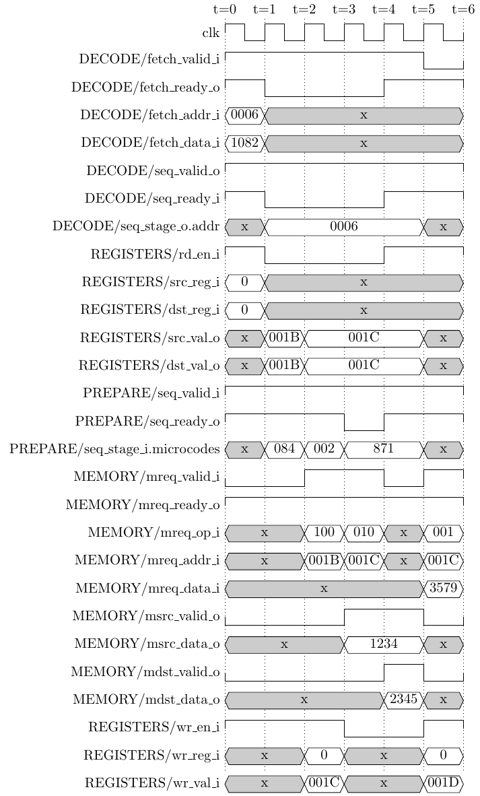

# The main QNICE pipeline

This is a detailed design description of the main CPU pipeline, particularly
the stages DECODE, PREPARE, and WRITE, and the SEQUENCER that joins the first
two.

Table of contents:
* [Block diagram](#Block-diagram)
* [Microcoding of instructions](#Microcoding-of-instructions)
* [External interfaces](#External-interfaces)
* [Internal interfaces](#Internal-interfaces)
* [Stages](#Stages)
* [Bypass](#Bypass)
* [Pipeline flush](#Pipeline-flush)
* [Formal verification](#Formal-verification)

## Block diagram


The remaining blocks are described else-where, see [main
documentation](../../doc/README.md#Detailed-design-description).

The three stages DECODE, PREPARE, and WRITE are combined into a single module
CPU_MAIN, drawn as the dotted outline in the diagram. This is mainly to
simplify the formal verification: `formal/cpu_main.psl` can then state
properties about the interfaces *between* the stages, which is where most of
the interesting behaviour is.

CPU_MAIN also instantiates the [SEQUENCER](sequencer.vhd), on the link
from DECODE to PREPARE. It is not a fourth stage: it holds no payload
registers, adds no latency, and its only state is the index of the
micro-operation it is currently presenting. It is a one-to-many adapter, taking
one beat per instruction from DECODE and producing one beat per
micro-operation for PREPARE.

## Microcoding of instructions

The really cool feature of this implementation is the conversion from the
CISC-like QNICE instructions to more RISC-like micro-operations. This
conversion is done dynamically, i.e. on-the-fly by the DECODE stage with the
help of a small ROM containing micro-code for the various instruction types.

The main purpose of this micro-coding is to reduce the complexity of the
implementation. The complexity arises from the advanced addressing modes,
particularly the fact that each instruction performs up to three memory
operations. For instance, the instruction `ADD @R0, @R1` performs a read from
`@R0`, then a read from `@R1`, and finally a write to `@R1`.  It is these three
memory operations that are "serialized" by the micro-coding. In other words,
each micro-operation performs at most one memory operation (read or write).

So to perform this translation we must essentially classify each instruction
depending on which (if any) memory operations it performs. This is done
primarily by examining the addressing mode of the source and destination
operand.

Note that this microcoding only concerns with splitting up the memory
operations. Therefore, any optional pre- or post-increment of the registers has
no influence on the micro-coding. Pre- and post-increment of registers is
instead handled by the WRITE stage.  This once again simplifies the design
since we here need only to distinguish between pure register addressing mode
against any of the three memory adressing modes.

With the above we have classified the instructions into four classes:
|  Instruction  | # of operations | Which operations                                                                    |
|  -----------  | --------------- | ----------------                                                                    |
| `INST  R,  R` |   1 operation   | Write to register.                                                                  |
| `INST  R, @R` |   2 operations  | Read from destination memory, write to destination memory.                          |
| `INST @R,  R` |   2 operations  | Read from source memory, write to register.                                         |
| `INST @R, @R` |   3 operations  | Read from source memory, read from destination memory, write to destination memory. |

Here `INST` is a general instruction like e.g. `ADD`.

I should note that some instructions don't have two operands. This includes
the Control instructions and the Jump instructions. These are treated
separately.

We could stop here with the micro-coding, but I've added several optimizations
to the above scheme.

### First optimization
First of all, some instructions don't need to read from destination memory.
This is e.g. the `MOVE` instruction.  Likewise, other instructions don't need
to write to destination memory. This is e.g. the 'CMP' instruction.  So we have
additional optimized versions for these instructions:
|  Instruction  | # of operations | Which operations                                                                    |
|  -----------  | --------------- | ----------------                                                                    |
| `MOVE  R,  R` |   1 operation   | Write to register.                                                                  |
| `MOVE  R, @R` |   1 operation   | Write to destination memory.                                                        |
| `MOVE @R,  R` |   2 operations  | Read from source memory, write to register.                                         |
| `MOVE @R, @R` |   2 operations  | Read from source memory, write to destination memory.                               |

|  Instruction  | # of operations | Which operations                                                                    |
|  -----------  | --------------- | ----------------                                                                    |
|  `CMP  R,  R` |   1 operation   | Update Status Register.                                                             |
|  `CMP  R, @R` |   2 operations  | Read from destination memory, update Status Register.                               |
|  `CMP @R,  R` |   2 operations  | Read from source memory, update Status Register.                                    |
|  `CMP @R, @R` |   3 operations  | Read from source memory, read from destination memory, update Status Register.      |

Note that even though the `CMP` instruction does not need to write to memory,
it still expands to the same number of micro-operations. This is because we
need one micro-operation to wait for the result read back from memory.

### Second optimization
Another optimization is that I treat immediate operands as a special case. An
immediate operand is encoded as `@R15++` in the instruction, but there is no need
to perform a read from memory in this case, because the value is already given
by the FETCH module.

What about instructions with `@R15++` in both operands, e.g. `ADD @R15++,
@R15++`?  The FETCH module only provides the first immediate operand.
Therefore, the second immediate operand is handled using a regular memory read.

Furthermore, other addressing modes involving the Program Counter, i,e. `@R15`
and `@--R15` are not optimized and instead handled as any other memory
operation. Note that `@--R15` will decrement the Program Counter, which in turn
(as described below) will be interpreted as a jump instruction.

### Pre- and post-increment
Special care must be taken when handling instructions like `ADD @R0++, @R0++`
since both the source and destination operands refer to the same register, and
this register is updated in both operands. It is therefore essential that the
source register is updated before issuing the read for the destination operand.

### Description of micro-operations
Each micro-operation consists of an array of 12 bits with the following meaning:

| Micro-operation |  Explanation                                               |
| --------------- | ---------------                                            |
|  `LAST`         | Indicates the last micro-operation for this instruction.   |
|  `REG_MOD_SRC`  | Optionally modify source register (`@R++` or `@--R`).      |
|  `REG_MOD_DST`  | Optionally modify destination register (`@R++` or `@--R`). |
|  `MEM_WAIT_SRC` | Wait for source operand from memory.                       |
|  `MEM_WAIT_DST` | Wait for destination operand from memory.                  |
|  `REG_WRITE`    | Write to destination register.                             |
|  `MEM_READ_SRC` | Read from memory to source.                                |
|  `MEM_READ_DST` | Read from memory to destination.                           |
|  `MEM_WRITE`    | Write to destination memory.                               |

Each of the three register operations (`REG_MOD_SRC`, `REG_MOD_DST`, and
`REG_WRITE`) work by issuing a write command to the Register file. Therefore,
they are mutually exclusive and at most one of these bits may be set.

The same applies to the three memory operations (`MEM_READ_SRC`,
`MEM_READ_DST`, and `MEM_WRITE`).

### Examples

Here I'll show a detailed description of some example instructions.

We'll start with a simple `MOVE R0, R1`. Since this instruction has no memory operations at all,
it simplifies to the following:
| Micro-operation |  One  |  Two  | Three |
| --------------- | ----- | ----- | ----- |
| `LAST         ` |   X   |       |       |
| `REG_MOD_SRC  ` |       |       |       |
| `REG_MOD_DST  ` |       |       |       |
| `MEM_WAIT_SRC ` |       |       |       |
| `MEM_WAIT_DST ` |       |       |       |
| `REG_WRITE    ` |   X   |       |       |
| `MEM_READ_SRC ` |       |       |       |
| `MEM_READ_DST ` |       |       |       |
| `MEM_WRITE    ` |       |       |       |

The instruction uses only one micro-operation.

An instruction like `MOVE @R0, @R1` requires two micro-operations:
| Micro-operation |  One  |  Two  | Three |
| --------------- | ----- | ----- | ----- |
| `LAST         ` |       |   X   |       |
| `REG_MOD_SRC  ` |   X   |       |       |
| `REG_MOD_DST  ` |       |   X   |       |
| `MEM_WAIT_SRC ` |       |   X   |       |
| `MEM_WAIT_DST ` |       |       |       |
| `REG_WRITE    ` |       |       |       |
| `MEM_READ_SRC ` |   X   |       |       |
| `MEM_READ_DST ` |       |       |       |
| `MEM_WRITE    ` |       |   X   |       |

* The first micro-operation issues a memory read to source operand and
  simultaneously (optionally) updates the source register. This latter
  operation has no effect for this particular instruction.
* The second micro-operation waits for the source operand to be read from
  memory, issues a write to destination memory, and optionally updates the
  destination register

An instruction like `ADD @R0, @R1` performs three memory instructions:
| Micro-operation |  One  |  Two  | Three |
| --------------- | ----- | ----- | ----- |
| `LAST         ` |       |       |   X   |
| `REG_MOD_SRC  ` |   X   |       |       |
| `REG_MOD_DST  ` |       |       |   X   |
| `MEM_WAIT_SRC ` |       |       |   X   |
| `MEM_WAIT_DST ` |       |       |   X   |
| `REG_WRITE    ` |       |       |       |
| `MEM_READ_SRC ` |   X   |       |       |
| `MEM_READ_DST ` |       |   X   |       |
| `MEM_WRITE    ` |       |       |   X   |

* The first micro-operation again issues a read to source operand and
  simultaneously (optionally) updates the source register, in case it is needed
  by the destination operand.
* The second micro-operations just issues a read to destination operand. Note
  that here the destination register is not updated, because the same value
  will be used during the memory write in the next micro-operation.
* The third and last micro-operation optionally updates the destination
  register, waits for both memory operands to be ready, and writes the result
  back to memory.

The PREPARE stage uses the `MEM_WAIT_SRC` and `MEM_WAIT_DST` microoperations to
control the flow through the pipeline. If any memory read operations have been
performed, the PREPARE stage waits for the read operations to be complete.

The WRITE stage uses the remaining microoperations to control the MEMORY and
REGISTERS modules.

### Waveforms
The picture below is taken from a GHDL simulation of
[test/prog_waveform.asm](../../test/prog_waveform.asm), a small program that
exists to produce exactly this diagram. It follows a single instruction, `ADD
@R0++, @R0++` (encoded as `0x1082`) at address `0x0006`. On entry `R0` is
`0x001B`, memory holds `0x1234` at `0x001B` and `0x2345` at `0x001C`, so the
instruction reads both operands, adds them to `0x3579`, writes that back to
`0x001C`, and leaves `R0` at `0x001D`.

The instruction occupies the pipeline for four clock cycles, t=1 to t=4, and
consequently the FETCH module is stalled for three of them, t=1 to t=3. In the
diagram the handshake bits (`valid`/`ready`/`enable`) are always drawn with
their true value, whereas the payload buses are greyed out whenever their
`valid` is low, or whenever they belong to a neighbouring instruction rather
than to this `ADD`. The breakdown is as follows:

* At time t=0: The FETCH module presents the single-word instruction and the
  DECODE stage accepts it in the same cycle. At the same time, the REGISTERS
  module is asked to read register 0, both as source and destination register.
* At time t=1: The instruction is now in `seq_stage_o`, and the SEQUENCER
  selects the first micro-operation `0x084` (`MEM_READ_SRC` + `REG_MOD_SRC`)
  out of the list that DECODE emitted. At the same time the register value
  `0x001B` is returned from the REGISTERS module.
* At time t=2: The SEQUENCER selects the second micro-operation `0x002`
  (`MEM_READ_DST`). Meanwhile the WRITE stage, which now holds `0x084`, issues
  the first memory request `MEM_READ_SRC` from address `0x001B` and asks the
  REGISTERS module to write `0x001B`+1 = `0x001C` to register 0. This written
  value is bypassed combinatorially and appears on `src_val_o`/`dst_val_o` in
  the very same cycle.
* At time t=3: The SEQUENCER selects the last micro-operation `0x871` (`LAST` +
  `REG_MOD_DST` + `MEM_WAIT_SRC` + `MEM_WAIT_DST` + `MEM_WRITE`), and the WRITE
  stage issues the request `MEM_READ_DST` from address `0x001C`. The source
  operand `0x1234` returns from the MEMORY module in this cycle, but the
  destination operand does not, so the `MEM_WAIT_DST` bit makes PREPARE pull
  `seq_ready` low and hold the micro-operation for one more cycle. This is the
  only stall in the whole diagram. No new value is written to the REGISTERS
  module.
* At time t=4: The destination operand `0x2345` arrives, `seq_ready` goes high
  again, and the last micro-operation is handed on to the WRITE stage. The FETCH
  module also gets to deliver a new word to the DECODE stage here; that word
  appears on `seq_stage_o` in the following cycle.
* At time t=5: The WRITE stage issues the last request `MEM_WRITE` of `0x1234` +
  `0x2345` = `0x3579` to address `0x001C`, and at the same time the REGISTERS
  module is instructed to update register 0 to the value `0x001D`.

Note how the two `@R0++` operands depend on each other: within this one
instruction `R0` must go `0x001B` -> `0x001C` -> `0x001D`, and the intermediate
value `0x001C` is only written back to the register file at t=2, long after
DECODE issued its read at t=0. This works because DECODE does not latch the
operand values at all; `seq_stage_o.src_val` and `seq_stage_o.dst_val` are
wired straight through to the REGISTERS outputs:

```vhdl
seq_stage_o.src_val <= reg_src_val_i; -- One clock cycle after reg_src_addr_o
seq_stage_o.dst_val <= reg_dst_val_i; -- One clock cycle after reg_dst_addr_o
```

So the write-before-read bypass inside the REGISTERS module (see
[Bypass](#Bypass)) is what holds `0x001C` on `dst_val_o` from t=2 to t=4, and it
is *that* value the WRITE stage increments to `0x001D` at t=5. Without the
bypass the second `@R0++` would work from the stale `0x001B` and leave `R0` at
`0x001C`.



The diagram is drawn by hand in [timing.tex](timing.tex), from values read off a
simulation run; `make diagrams` regenerates `timing.png` from it.

## External interfaces
In the following I'll describe in detail the interfaces to the various
surrounding blocks.

### From FETCH to DECODE
```
fetch_valid_i  : in  std_logic;
fetch_ready_o  : out std_logic;
fetch_double_i : in  std_logic;
fetch_addr_i   : in  std_logic_vector(15 downto 0);
fetch_data_i   : in  std_logic_vector(31 downto 0);
fetch_double_o : out std_logic;
```
This AXI-interface accepts one or two words from the FETCH module. The signal
`fetch_double_i` from the FETCH module indicates whether the signal
`fetch_data_i` contains one or two words.
Correspondingly, the signal `fetch_double_o` back to the FETCH module indicates
whether we wish to consume one or two words.

The idea behind this is that some instructions contain an immediate operand.
Transferring two words (i.e. instruction and immediate operand) simultaneously
greatly simplifies the implementation of the DECODE stage.  Furthermore, this
allows [interleaving](../../doc/README.md#Interleaving) of consecutive
instructions resulting in higher performance.

The instruction is always present in bits 15-0 and any immediate operand (or
possibly the next instruction) is optionally present in bits 31-16. The signal
`fetch_addr_i` contains the address (i.e. Program Counter) of the instruction.

It is here worth noting that even though the REGISTERS module contains all the
CPU registers, the Program Counter (`R15`) is instead stored in the FETCH
module and forwarded through the pipeline as a separate signal.

### From DECODE to REGISTERS
```
reg_rd_en_o   : out std_logic;
reg_src_reg_o : out std_logic_vector(3 downto 0);
reg_src_val_i : in  std_logic_vector(15 downto 0);
reg_dst_reg_o : out std_logic_vector(3 downto 0);
reg_dst_val_i : in  std_logic_vector(15 downto 0);
reg_r14_i     : in  std_logic_vector(15 downto 0);
```
The DECODE stage reads from the REGISTERS module. Note that the values read back
(in `reg_src_val_i` and `reg_dst_val_i`) are valid on the following clock
cycle. I.e. there is a fixed one-clock-cycle latency.

We could have used the standard AXI-interface with `VALID` and `READY` signals,
but since the latency is constant, I've chosen not to. However, we do need the
signal `reg_rd_en_o` because when back-pressure is received from the PREPARE
stage, we don't want to issue new read requests, i.e. we don't want the values
`reg_src_val_i` and `reg_dst_val_i` to change.

The signal `reg_r14_i` always returns the current value of the Status Register
`R14`. This is needed in the WRITE stage for the ALU and for conditional
branching.

### From WRITE to REGISTERS
```
reg_we_o     : out std_logic;
reg_addr_o   : out std_logic_vector(3 downto 0);
reg_val_o    : out std_logic_vector(15 downto 0);
reg_r14_we_o : out std_logic;
reg_r14_o    : out std_logic_vector(15 downto 0);
```

The WRITE stage calculates a new value for the destination register and
simultaneously a new value for the Status Register `R14`. There is a separate
Write-Enable for the destination and status registers. There is no support for
back-pressure, simply because the Register file always accepts and performs a
write.

### From WRITE to MEMORY
```
mem_req_valid_o : out std_logic;
mem_req_ready_i : in  std_logic;
mem_req_op_o    : out std_logic_vector(2 downto 0);
mem_req_addr_o  : out std_logic_vector(15 downto 0);
mem_req_data_o  : out std_logic_vector(15 downto 0);
```
It is the WRITE stage that issues both read and write requests to the MEMORY
module. This is because the DECODE stage generates micro-operations that each
perform at most one memory operation.

This interface is closely linked together with how the [Wishbone
interface](../../doc/README.md#Wishbone) works and how the [MEMORY
module](../memory/README.md) is designed.

Note that we have the standard AXI-interface controlling when the MEMORY module
accepts a transaction request (read or write). The type of request is
controlled by the one-hot-encoded `mem_req_op_o` signal:
* Bit 2 : Read from memory and store in Source buffer.
* Bit 1 : Read from memory and store in Destination buffer.
* Bit 0 : Write to memory.

Exactly one of these three bits must be set for any transaction.

Since all memory transactions are controlled by the same stage (WRITE), this
greatly simplifies the MEMORY module. Correspondingly, since the MEMORY module
contains buffers for both Source and Destination operands, this greatly
simplifies the PREPARE module, see below.

### From MEMORY to PREPARE
```
mem_src_valid_i : in  std_logic;
mem_src_ready_o : out std_logic;
mem_src_data_i  : in  std_logic_vector(15 downto 0);
mem_dst_valid_i : in  std_logic;
mem_dst_ready_o : out std_logic;
mem_dst_data_i  : in  std_logic_vector(15 downto 0);
```

The PREPARE module receives optionally a Source and/or a Destination operand
from the MEMORY module. The interface uses two parallel AXI-interfaces, which
again significantly simplifies the PREPARE stage.


### From WRITE to FETCH
The interfaces described so far work for almost all instructions and
addressing modes.  However, during branches the Program Counter `R15` inside
the FETCH module must be updated. This is controlled by the following two
signals generated by the WRITE stage.
```
fetch_valid_o : out std_logic;
fetch_addr_o  : out std_logic_vector(15 downto 0);
```
These are mostly decoded directly from the register write port: `fetch_valid_o`
is asserted whenever WRITE writes to register 15, and `fetch_addr_o` is that
write value. The same `fetch_valid_o` also flushes the pipeline, see
[Pipeline flush](#Pipeline-flush) below.

The one case that is not a write to `R15` is a change of the register bank, see
[Register bank switch](#Register-bank-switch).

One class of branch does *not* redirect from here, because DECODE has already
done it two cycles earlier — see [From DECODE to FETCH](#From-DECODE-to-FETCH)
immediately below.

### From DECODE to FETCH
```
early_valid_o : out std_logic;                      -- combinatorial
early_addr_o  : out std_logic_vector(15 downto 0);  -- combinatorial
```
A second redirect port, driven by DECODE rather than WRITE, for the one class of
branch DECODE can resolve by itself: an unconditional jump to an immediate
target, i.e. `ABRA`/`ASUB`/`RBRA`/`RSUB <label>, 1`. See
[Early redirect](#Early-redirect).

The two redirect ports are mutually exclusive and `cpu.vhd` merges them into the
single one `fetch.vhd` sees, so FETCH itself is unaware of the distinction.

### Between WRITE and DECODE
```
bank_switch_o : out std_logic;   -- WRITE -> DECODE
bank_stale_i  : in  std_logic;   -- DECODE -> WRITE
```
The only signals in CPU_MAIN that skip a stage. They exist so that an
`INCRB`/`DECRB` does not have to flush the pipeline unconditionally; both are
combinational and both are explained under
[Register bank switch](#Register-bank-switch).

### Halt
```
halt_o : out std_logic;
```
This output is asserted for one clock cycle when a `HALT` instruction retires,
i.e. it is `inst_done_o` qualified by the instruction being `CTRL HALT`. `HALT`
has no architectural effect inside CPU_MAIN; all this does is tell the outside
world that the program has run to completion.

Acting on it is [cpu.vhd](../cpu.vhd)'s job, and it does so at the *other* end
of the pipeline: `p_halt_fetched` there watches the ICACHE-to-DECODE handshake
and gates it off as soon as a `HALT` is handed to DECODE, so that the `HALT` is
the last instruction to enter the pipeline. Gating on `halt_o` itself would be
too late — the next one or two instructions have already been accepted by then,
and would retire after the `HALT`, executing whatever data follows it in memory.
That gate is cleared again by a pipeline flush, because a `HALT` that DECODE has
accepted is not necessarily a `HALT` that will execute: an older branch retiring
discards it. `test/prog_pipeline.asm` branches over twelve `HALT`s used as
padding and depends on this.

`halt_o` is also the end-of-test event for `test/test_monitor.vhd`, see
[test/README.md](../../test/README.md).

### Debug
```
inst_done_o : out std_logic;
```
This output is asserted for one clock cycle whenever the WRITE stage accepts the
micro-operation marked `LAST`, i.e. once per completed instruction. It is not
used by the CPU itself; it drives the instruction counter in the testbench and
gates the call to the `disassemble` procedure inside a `pragma synthesis_off`
block in [write.vhd](write.vhd).

## Internal interfaces
This section describes the interfaces interfaces between the three stages
DECODE, PREPARE, and WRITE.

The interface from DECODE to the SEQUENCER, from the SEQUENCER to PREPARE, and
from PREPARE to WRITE is a standard AXI-interface accompanied by the following
record data structure. The SEQUENCER passes the record through unchanged apart
from the low 12 bits of `microcodes`, so the DECODE-to-PREPARE path really is
one interface with an adapter in the middle:
```
type t_stage is record
   microcodes  : std_logic_vector(35 downto 0);
   addr        : std_logic_vector(15 downto 0);
   inst        : std_logic_vector(15 downto 0);
   immediate   : std_logic_vector(15 downto 0);
   src_addr    : std_logic_vector(3 downto 0);
   src_mode    : std_logic_vector(1 downto 0);
   src_val     : std_logic_vector(15 downto 0);
   src_imm     : std_logic;
   dst_addr    : std_logic_vector(3 downto 0);
   dst_mode    : std_logic_vector(1 downto 0);
   dst_val     : std_logic_vector(15 downto 0);
   dst_imm     : std_logic;
   res_reg     : std_logic_vector(3 downto 0);
   r14         : std_logic_vector(15 downto 0);
   alu_oper    : std_logic_vector(3 downto 0);
   alu_ctrl    : std_logic_vector(5 downto 0);
   alu_flags   : std_logic_vector(15 downto 0);
   alu_src_val : std_logic_vector(15 downto 0);
   alu_dst_val : std_logic_vector(15 downto 0);
end record t_stage;
```

The element `microcodes` carries the whole list of up to three 12-bit
micro-operations produced by the microcode ROM (3 x 12 = 36 bits). The SEQUENCER
presents them one at a time by overwriting bits 11-0 with the selected chunk, so
from PREPARE onwards the micro-operation to be performed is in bits 11-0. The upper bits still hold the raw, unselected list and must not
be consumed downstream.

The elements `addr`, `inst`, and `immediate` are the address, instruction, and
immediate operand passed on from the FETCH module.

The flags `src_imm` and `dst_imm` indicate whether the source or destination
operand should use the immediate value passed on.

The elements `src_addr`, `src_mode`, and `src_val` indicate the source register
number, the source operand addressing mode, and the source register value (from
REGISTERS module). Similarly for the destination register.

The element `res_reg` indicates which register to write the result back into.
It equals the destination register for all ordinary instructions. The exception
is the jump instructions, where DECODE forces `res_reg` to `R15` so that the
branch target lands in the Program Counter. For the subroutine variants
(`ASUB`/`RSUB`) the destination register is at the same time rewritten to `R13`
with pre-decrement addressing, so that the return address is pushed onto the
stack while `res_reg` still points at `R15`.

Finally, `r14` contains the current value of the Status Register.

**Not every element is latched.** DECODE registers `microcodes`, `addr`, `inst`,
`immediate`, `src_addr`, `src_mode`, `src_imm`, `dst_addr`, `dst_mode`,
`dst_imm` and `res_reg` in its output process, but `src_val`, `dst_val` and
`r14` are *concurrent* assignments straight from the register file read ports.
They therefore keep moving while DECODE is stalled, and that is deliberate: it
is how a stalled instruction picks up a register or Status Register write issued
by the older instruction still in WRITE, and how the second micro-op of
`ADD @R0++, @R0++` sees the `R0` update made by the first. The consumer only
ever samples them at the moment it accepts a beat, so their movement in between
is harmless. Freezing them would silently reintroduce stale-operand hazards.

The remaining elements `alu_*` are only used from PREPARE to WRITE. They contain
all the values needed by the ALU.

## Stages

### DECODE
The main back-bone of the DECODE stage is the micro-code ROM implemented in the
file [microcode.vhd](sub/microcode.vhd). The entry to this ROM is a four-bit
signal describing the classification of the current instruction. This
classification is encoded in the following four bits:
* `reads_from_dst` : The instruction wants to read from the destination operand.
* `writes_to_dst`  : The instruction wants to write to the destination operand.
* `src_memory`     : The source operand belongs in memory.
* `dst_memory`     : The destination operand belongs in memory.

The latter two bits are de-asserted in the special case of `@R15++`.

The microcode ROM returns (combinatorially) a list of up to three
micro-operations, packed into the 36-bit `microcodes` element of `t_stage`.
DECODE forwards that entire list in a single beat; it is the
[SEQUENCER](sequencer.vhd), sitting between DECODE and PREPARE, that splits
(sequences) it into separate clock cycles.

This implies a contract between DECODE and the SEQUENCER: the `LAST` bit must be
set no later than the top (third) chunk of the list. The SEQUENCER derives its chunk
index range from the width of `microcodes`, so a fourth chunk would index past
the end of the list. Every entry of the microcode ROM, and every one of the jump
overrides in [decode.vhd](decode.vhd), sets `LAST` in the top chunk. The
contract is stated in the header of [sequencer.vhd](sequencer.vhd) and
assumed in `formal/sequencer.psl`.

One additional complexity handled by the DECODE module is the special case of
jump instructions (`ABRA`, `RBRA`, `ASUB`, and `RSUB`).

### PREPARE

#### Reading R15

The working Program Counter lives in the FETCH stage. The register file does
hold an `R15`, but it is only written when an instruction actually targets
`R15` — i.e. on branches — so during sequential execution it is stale and must
never be used as an operand value.

PREPARE therefore substitutes the real PC into `src_val`/`dst_val` before
anything downstream sees them (`src_val_pc`/`dst_val_pc` in
[prepare.vhd](prepare.vhd)). Doing the substitution on the stage record, rather
than only on the ALU inputs, matters because the WRITE stage derives two other
things from `src_val`/`dst_val`: the memory address for `@R15` and `@--R15`,
and the pre/post-increment write-back. All three have to agree.

The substituted value is the address of the next word to be fetched at the
point the operand is read, matching `qnice.c`, which advances a single PC
register immediately after the instruction fetch and then reads both operands
through it:

| Operand | Value |
| ------- | ----- |
| source `R15` | `addr+1` always — an immediate belongs to the destination, and is fetched only after the source has been read |
| destination `R15` | `addr+2` when the source was an immediate (that fetch has already advanced the PC), otherwise `addr+1` |

`@R15++` never reaches this logic: DECODE flags it as an immediate and FETCH
supplies the value inline.

Because this is the value of the register itself, it applies in every
addressing mode. `test/prog_r15.asm` covers the source path, the destination
path, and `@R15`; `CMP R15, R15` is a useful differential check, since it must
set `Z` only if the two paths agree.

#### Sequencing

This stage's input comes from the [SEQUENCER](sequencer.vhd), which expands
the single beat DECODE emits into one beat per micro-operation. The SEQUENCER
adds no latency (it is combinatorial in the forward direction), but it holds its
`s_ready_o` low until the chunk marked `LAST` has been accepted downstream. That
is the first of the two sources of back-pressure towards FETCH. The second is
the wait for memory read data, expressed by the `MEM_WAIT_SRC` and
`MEM_WAIT_DST` micro-operations, and that one *is* raised here — `seq_ready_o`
in [prepare.vhd](prepare.vhd), which the SEQUENCER passes on to DECODE.

The SEQUENCER used to be instantiated inside this stage. It was moved out to
`cpu_main.vhd` because it belongs to neither stage: it does no operand
preparation, and its `s_ready_o` is the DECODE handshake rather than PREPARE's.
The move is a pure hierarchy change, and was measured as one: every test
program's writes log and cycle count is byte-identical across it, and a
`-flatten_hierarchy none` synthesis reports the same 971 LUTs and 585
flip-flops for the CPU before and after, with PREPARE's 79/133 splitting
exactly into 70/131 plus the SEQUENCER's 9/2 (see
[Where the logic is](../../doc/README.md#Where-the-logic-is)).

[sequencer.vhd](sequencer.vhd) later followed it out of `sub/` and now sits
beside the stages it joins, which leaves `sub/` holding exactly what the stages
instantiate internally: the microcode ROM and the ALU.

Apart from that, this stage is quite small and mainly serves the function of
adding some flip-flops in an otherwise very long combinatorial path. In other words, this
stage almost halves the longest combinatorial delay thus essentially doubling
the maximum frequency. However, the cost is increased data hazards due to a
longer pipeline, and therefore additional bypass handling is needed, as well as
occasional pipeline stalls.

### WRITE
This stage contains the ALU and writes result back to the REGISTERS or MEMORY
module.  Additionally, it handles pre- and post-increment of the registers.

## Bypass

> This logic is exercised by simulation: `test/prog_hazard.asm` drives
> read-after-write hazards between adjacent instructions.

Whenever one has a pipelined architecture, where later stages write back to
storage (i.e. register file) that is read in an earlier stage, we have a
potential data hazard. In other words, we need to ensure that the register
values read in the DECODE stage are not stale compared to the values written in
the WRITE stage. In this design that is handled entirely inside the REGISTERS
module; CPU_MAIN itself carries no bypass logic, which is less obvious than it
sounds and is explained below.

### Write-before-read in the REGISTERS module
The REGISTERS module resolves the common case itself: a write from the WRITE
stage that coincides with a read from the DECODE stage returns the newly written
value rather than the stale one. This is a combinational bypass built into the
register file, described in
[registers/README.md](../registers/README.md#Operation). No action is needed in
CPU_MAIN for this case. The [waveform](#Waveforms) above shows this bypass at
work within a single instruction: the two `@R0++` operands of `ADD @R0++, @R0++`
chain through it.

### Why the WRITE stage needs no Status Register bypass

The WRITE stage both consumes and produces the Status Register within the same
instruction, so it looks like it should need a bypass of its own — and it used
to have one: a `p_bypass` process holding a one-cycle-delayed copy of everything
this stage wrote to the REGISTERS module, feeding a priority mux in front of
`prep_stage_i.r14`.

That was removed as dead code. A probe on it never fired once in 8286 accepted
beats of `test/prog.asm`, and removing it left every test program passing with
the golden writes logs (`test/*.writes.golden`) byte-identical. The reason is
structural, and worth understanding before anyone adds it back:

* `registers.vhd` forwards **both** Status Register write ports combinationally
  onto `sr_val_o` (see
  [registers/README.md](../registers/README.md#Write-Before-Read-on-the-dedicated-SR-port)).
* DECODE passes `reg_r14_i` through as a *live*, unregistered signal — see the
  note on latched versus live elements under
  [Internal interfaces](#Internal-interfaces).
* WRITE only ever issues a register write on a cycle where PREPARE is
  simultaneously latching a fresh beat, because both are gated by the same
  ready signal.

Put together: the `r14` value arriving at WRITE has already absorbed any write
WRITE itself made. `prep_stage_i.r14` is therefore used directly, and it feeds
only the conditional-branch decision (`update_reg`). The ALU takes its flags
from `prep_stage_i.alu_flags`, which PREPARE latched from the same source in the
same cycle — the two are always bit-identical.

## Pipeline flush
Any update of the Program Counter invalidates whatever DECODE and PREPARE have
already speculatively fetched and decoded from the fall-through path. Rather
than adding a separate flush signal, CPU_MAIN reuses `fetch_valid_o`: in
[cpu_main.vhd](cpu_main.vhd) the DECODE, SEQUENCER and PREPARE instances are
reset with `rst_i or fetch_valid_o`, while WRITE gets the plain `rst_i`.

So every branch, and every other write to `R15`, clears everything upstream in
the same cycle that the new PC is handed to FETCH. For the SEQUENCER that means
its chunk index goes back to 0, abandoning a half-issued micro-operation list. The WRITE stage is
deliberately not flushed, since it is the stage producing the branch and must be
allowed to complete the instruction that caused it.

This also covers the exit from reset. While `rst_i` is asserted, the `p_reg`
process in [write.vhd](write.vhd) forces a write of `R15 = 0`, which in turn
asserts `fetch_valid_o` and so starts execution from address 0 with a clean
pipeline.

### Early redirect
A branch costs four cycles because WRITE resolves it two stages after DECODE
read it: one cycle to register the new PC in FETCH, one for the instruction
memory's read latency, one in the ICACHE, and one because DECODE and PREPARE are
then empty. Measured on `test/prog.asm`, redirects account for 3625 cycles of a
15030-cycle run — **24%**.

For one class of branch none of that has to wait, because everything the
redirect needs is already sitting in DECODE:

* **Unconditional.** The condition field of `X <label>, 1` selects `SR` bit 0,
  which reads as 1 always, and is not negated. There are no flags to wait for,
  so no dependency on the instructions still ahead of it in the pipeline.
* **Immediate target.** The target is the word FETCH already supplied alongside
  the instruction. No register read, no memory read. DECODE even computes the
  absolute target for the relative modes already, for `seq_stage_o.immediate`.

So `early_jmp` in [decode.vhd](decode.vhd) recognises the instruction and
DECODE issues the redirect on the cycle it accepts it, two cycles before WRITE
would have. The penalty drops from **four cycles to two**, and to **one** for
`ASUB`/`RSUB`, whose second micro-op holds the branch in DECODE's output
register for an extra cycle and so overlaps one more cycle of the refill.

This matters far more than the test suite suggests. Only 73 of `prog.asm`'s 731
redirects are of this form, but counting branches in the QNICE-FPGA monitor
sources gives 328 `RSUB <label>, 1`, 182 `RBRA <label>, 1` and 308 conditional
`RBRA` — **62% unconditional with an immediate target**, because that is what
every subroutine call and every unconditional jump assembles to.
`test/prog_subroutine.asm` exists to keep an honest figure in the suite: it
falls from 678 to 580 cycles, **−14.5%**, against −1.0% for `prog.asm`.

Three things make it work, and each is easy to undo:

**The early redirect flushes FETCH and the ICACHE only — never DECODE or
PREPARE.** By the end of the cycle the branch is in DECODE's output register,
and everything downstream of it is *older*, so the only wrong-path instructions
in the machine are the ones FETCH and the ICACHE hold. That is what makes this
cheaper than resolving a branch early in general, and it is why `cpu.vhd` keeps
`icache_rst` (from WRITE) and `icache_flush` (from DECODE) as separate signals.

**The ICACHE flush has to be *soft*.** Its ordinary `rst_i` gates `m_valid_o`
combinationally, which is mandatory for WRITE's flush and fatal for this one:
DECODE raises the flush *because* it is accepting the branch being offered this
cycle, so gating `m_valid_o` would withdraw the very handshake that produced the
flush, and the loop settles on "no branch accepted, no flush" — the optimisation
silently doing nothing. `flush_i` therefore clears the buffer at the clock edge
and gates `s_ready_o`, but leaves `m_valid_o` alone; this is the same asymmetry
`two_stage_fifo` documents in its own contract (b). `f_flush_offers` and
`f_cover_flush_handshake` in [icache.psl](../../formal/icache.psl) are the
tripwires for anyone "fixing" it.

**WRITE must not redirect again when the branch retires**, or it would discard
exactly the instructions the early redirect went to fetch. `prep_stage_i.early_jmp`
carries that down the pipeline, in `t_stage` beside `is_crb` and for the same
reason — it is decoded where the instruction word already is, rather than in
front of `fetch_valid_o`. Note the `rst_i` term next to it in
[write.vhd](write.vhd): `p_reg` forces a write of `R15 = 0` during reset and
that is how FETCH gets its initial PC, but PREPARE's output register is not
cleared by reset, so the stale `early_jmp` left there by the last branch would
otherwise suppress it.

#### What it costs
**0.091 ns of the 0.093 ns of timing margin there was** — WNS +0.093 ns to
+0.002 ns at the 7.25 ns constraint. It still closes, and at the shipping
frequency the cycles are free, but there is essentially nothing left for the
next change. The critical path is unmoved, still register-to-register inside
PREPARE through the ALU operand muxing, which none of this touches; the cost is
the placement sensitivity described in
[doc/README.md](../../doc/README.md#The-critical-path) rather than logic added
to the path. Measured across four builds: +0.093 (baseline), +0.036 (early
redirect with the reset guard omitted, which is not safe), +0.002 (as
committed), +0.007 (guard moved into PREPARE's reset, which buys 0.005 ns and
costs an assumption that reset is held for more than one cycle).

It also narrows one self-modifying-code margin from three cycles to one. A store
that lands more than 32 words away misses `smc_hit`'s window, and is safe today
because "nothing has read that address yet". If the very next instruction is an
unconditional branch *to* that address, the fetch of the target now happens one
cycle after the store's write is accepted on the data bus rather than three.
That is still correct, and structurally so: DECODE cannot accept the branch
before the store's last micro-op has left its output register, so the fetch can
never be issued earlier than the cycle after the store's bus request. But the
margin is one cycle, and it assumes a data-bus slave that does not stall — the
dual-port RAM here never does.

### Register bank switch
The other thing that flushes the pipeline is a change to the upper eight bits of
`R14`, which select which of the 256 pages of `R0`-`R7` the REGISTERS module
presents (`INCRB`, `DECRB`, or an ordinary write to `R14` that lands in those
bits).

This has to be a flush, not a bypass. DECODE issues a register read two stages
ahead of WRITE, so by the time `INCRB`'s new bank reaches the REGISTERS module,
the read for the instruction *after* it has already gone out — against the old
bank. Forwarding the bank into `lower_rd_addr_src`/`lower_rd_addr_dst` does not
help either: the address was applied to the RAM a full cycle before the new bank
existed. Measured on the instruction pair `DECRB` / `MOVE R0, R9`, the read is
issued one cycle before the `wr_sr_en_i` write lands.

So the bank switch joins `fetch_valid_o` in [write.vhd](write.vhd), redirecting
FETCH to the address of the following instruction — the same value that
`ASUB`/`RSUB` push as a return address. The instruction that comes back has its
register read issued long after `reg_sr` has caught up. That is what an ordinary
write to `R14` costs: a full branch penalty.

The trigger is deliberately *syntactic* — "this instruction writes `R14`, or it
is `INCRB`/`DECRB`" — and not a comparison of the new bank against the old. The
precise version is more selective, and would leave the common
`MOVE ST____C_, R14` idiom free of a flush, but it costs the entire timing
margin: `fetch_valid_o` is the reset pin of every flip-flop in two stages, so
feeding it from `reg_val_o` puts the ALU result and an 8-bit comparator in front
of a high-fanout net. The measured numbers are in the "Register bank switch"
comment in [write.vhd](write.vhd). The price of the syntactic form is that *any* write to
`R14` costs a branch penalty, `MOVE ST____C_, R14` included.

Because the trigger keys on `reg_addr_o`, which the combinational `p_reg` drives
for pre/post-increment write-backs as well as for ordinary results, it covers
`R14` used as a *pointer* (`MOVE @R14++, R0`) too, on any micro-op rather than
only the last.

#### Only two instructions are ever at risk
`INCRB`/`DECRB` does better than a full flush, because it is the instruction the
ISA uses to enter and leave a subroutine and is therefore worth two extra
signals between WRITE and DECODE. Exactly two instructions can have read the
outgoing bank by the time the switch retires in WRITE:

| | Where it is | What its register read did | Remedy |
|---|---|---|---|
| I1 | DECODE's output register | Issued a cycle ago, against the old bank. DECODE passes `src_val`/`dst_val` through as *live* wires, so the values are already gone. | Flush. |
| I2 | DECODE's input | Being issued in this very cycle, still against the old bank: `reg_sr` does not take the new value until this cycle's clock edge. But nothing has accepted it yet. | Hold `fetch_ready_o` low for one cycle, so it reads again from the new bank. |

Anything further back issues its read at least one cycle from now and picks up
the new bank by itself, which is why the list stops at two.

Neither I1 nor I2 is a hazard unless it actually *uses* a value that came out of
the banked half of the register file. Writing `R0`-`R7` does not count: the write
travels down the pipeline as a register *number* and is applied against whatever
bank is current when it retires — the new one, which is the right one.
`uses_bank` in [decode.vhd](decode.vhd) works that out from the instruction being
decoded:

* the source operand is consumed whenever there is one — as an ALU input in
  register mode, as an address in every other — and only `CTRL` has none;
* the destination operand is consumed when the opcode reads it (everything
  except `MOVE`/`SWAP`/`NOT`/`CTRL`/`JMP`, whose flags come from the result
  alone, see [alu_flags.vhd](sub/alu_flags.vhd)) or when it is not in register
  mode, i.e. when the register holds a pointer.

`MOVE R8, R0` uses neither, and that is the point of the whole exercise: it is
the standard way to pass an argument into a freshly entered bank, and
`MOVE @R13++, R15` — the return — reads nothing banked either. So `bank_switch_o`
tells DECODE that a switch is retiring, DECODE holds its input only if that
input uses a banked value, and `bank_stale_o` comes back saying whether I1 does,
which is the only case that still flushes.

An `INCRB`/`DECRB` therefore costs a full branch penalty only when the
instruction immediately after it reads `R0`-`R7`, one cycle when the one after
*that* does, and nothing at all otherwise. Measured: all ten bank switches in
`test/prog.asm` now fall in the last category, taking that program from 15070 to
15030 cycles — the branch penalty here is 4 cycles apiece.

One implementation note that is easy to undo: `bank_switch_o` reads
`prep_stage_i.is_crb`, a bit DECODE decodes from the instruction word and
carries down in `t_stage`, rather than re-deriving "opcode is `CTRL` and
command is `INCRB`/`DECRB`" in WRITE. That test is ten bits and two levels of
logic sitting directly in front of `fetch_valid_o`; moving it two stages earlier
trades one flip-flop per stage for two levels off the design's most
timing-critical net, and the whole change closes timing with it and does not
without.

The qualification deliberately does **not** extend to the ordinary-`R14`-write
term. `R14` and `R15` share `reg_addr_o(3 downto 1) = "111"`, which is what
collapses "writes `R14`" and "writes `R15`" into a single product term; telling
them apart to spare `R14` the flush would add an input to the most
timing-critical net in the design in order to speed up a case `INCRB`/`DECRB`
already covers. Note that the unconditional flush also stands in for the I2 hold:
it discards I1 and I2 alike.

`test/prog_hazard.asm` covers this in `H11`-`H17`: `H11`-`H13` that the flush
happens when it must (`INCRB`/`DECRB`, an ordinary write to `R14`, and a write to
`R14` that does *not* move the bank), `H14`-`H15` that a write-only instruction
after the switch is neither flushed nor left in the old bank, and `H16`-`H17`
that a destination read and a pointer read are still caught. Simulation of the
CPU shows all three outcomes occurring: of the eighteen bank switches in that
program, three flush, eight hold and seven are free.

What the test programs cannot show is that the over-approximation is *complete*.
That is `f_flush_on_bank_change` and `f_hold_on_bank_change` in
[formal/cpu_main.psl](../../formal/cpu_main.psl). Both state the requirement
directly — whenever the upper eight bits of `R14` change, an in-flight
instruction that consumes a banked value must be either flushed (I1) or not
accepted (I2) — and both derive "consumes a banked value" from the raw
instruction encoding rather than from `uses_bank`, so narrowing `uses_bank`
fails them. Verified by doing exactly that: dropping the destination half of
`uses_bank` fails `f_hold_on_bank_change`, and forcing `bank_stale_o` low fails
`f_flush_on_bank_change` and `f_flush_on_crb`.

### Self-modifying code
The third thing that flushes the pipeline is a store into the instruction stream.
Instruction and data memory are the same physical RAM, so `MOVE R1, @R0` can land
on an address that FETCH, the ICACHE, DECODE or PREPARE has already read — and
the stale copy would then execute with nothing noticing.

`smc_hit` in [write.vhd](write.vhd) detects this and joins `fetch_valid_o`. The
subtlety is entirely in keeping it cheap: this net is the reset pin of every
flip-flop in two stages, so the comparison subtracts two *raw* stage registers
(`prep_stage_i.dst_val` and `prep_stage_i.addr`) and tests a power-of-two window,
rather than comparing the exact store address against the exact re-fetch address.
The exact form puts a four-way mux and an adder in front of the subtraction and
does not meet timing; the numbers and the derivation of the constant are in the
comment above `smc_delta`.

See [Self-modifying code](../../doc/README.md#Self-modifying-code) for the
architectural picture and [`test/prog_self_modifying.asm`](../../test/prog_self_modifying.asm)
for the coverage. `f_flush_on_smc` in
[formal/cpu_main.psl](../../formal/cpu_main.psl) pins the window from the other
side: it measures the *real* store address (`mem_req_addr_o`, i.e. after the
pre-decrement mux) against the retiring instruction's address, so it constrains
how far `smc_hit`'s cheaper subtraction may be tightened.

## Formal verification
`formal/cpu_main.psl` verifies the assembled DECODE + PREPARE + WRITE pipeline
against a free (unconstrained) environment for FETCH, the REGISTERS module and
the MEMORY module. The environment assumptions model the valid/ready contract on
each interface, the fixed one-cycle read latency of the REGISTERS module, and the
fact that at most one source and one destination read may be outstanding
towards the MEMORY module at a time.

The assertions fall into four groups:

* **Internal handshakes.** `f_dec2seq_valid_stable` and `f_prep2wr_valid_stable`
  check that the payload and valid of each internal stage interface hold stable
  while stalled. Both carry an explicit `not fetch_valid_o` escape clause,
  because a pipeline flush (see above) legitimately drops valid mid-transfer.
  `f_dec2seq_valid_stable` enumerates the eleven *latched* elements of
  `t_stage` rather than asserting `stable()` over the whole record, because
  `src_val`, `dst_val` and `r14` are live pass-throughs (see
  [Internal interfaces](#Internal-interfaces) above). `f_dec2seq_live_src` /
  `_dst` / `_r14` assert the complementary fact — that those three really are
  pure pass-throughs — so that registering one by mistake is caught too.
  `c_dec2seq_stalled` and `c_dec2seq_stalled_sr` cover the stall condition,
  and the stall-with-SR-write case in particular, to show the stability
  assertion is not vacuous.
* **Output interfaces.** `f_fetch_double` checks that we never accept a single
  word when we need two; `f_mem_src_ready_stable` / `f_mem_dst_ready_stable`
  check the ready signals towards the MEMORY module; `f_r14_bit0` checks the
  QNICE invariant that bit 0 of the Status Register always reads back as `1`.
* **Instruction behaviour.** `f_mov_r_r_read` and `f_mov_r_r_write` are the two
  properties that reason about an actual instruction. Using `anyconst`
  source/destination register numbers, they assert that accepting a
  `MOVE Rs, Rd` (with `Rs /= R15`) issues the matching register read in that
  same cycle, and that whenever such a MOVE *completes* in WRITE it writes `Rd`
  with the value read for `Rs`, updates the flags, and issues no memory request.
  `c_mov_read`, `c_mov_write`, `c_mov_write_pc` and `c_mov_write_gp` cover both
  triggers, including the `Rd = R15` case where the MOVE doubles as a jump.

  These two replace an earlier single property of the shape
  `{accepted} |-> {read; true[*]; completion}`, which was **vacuous past its
  first term**: `true[*]` is an unbounded SERE repetition, so on a finite BMC
  trace the tail is always merely "pending" rather than violated. Inverting the
  written value, corrupting the written address, and suppressing the register
  write altogether all went undetected; only the read term had any effect.
  Bounding the repetition is not an option either, because the completion
  latency is genuinely unbounded — a preceding load stalls the pipeline until
  `mem_src_valid_i` arrives, and nothing forces a response ever to arrive. The
  eventuality is therefore dropped rather than faked: neither property claims
  the instruction eventually completes, which is liveness and out of reach for
  BMC anyway.

  Note also what the environment does *not* cover: the assumption tying reads of
  `c_src_reg` to the constant `c_src_val` models that register as never
  changing, so traces where the design writes to it are excluded from every
  property in the file.

* **Pipeline flush.** `fetch_valid_o` is not only the redirect back to FETCH; it
  is the reset pin of every flip-flop in DECODE and PREPARE, so everything that
  raises it is a flush (see [Pipeline flush](#Pipeline-flush) above). Four
  properties cover the two conditions that used to rest on simulation alone.
  `f_flush_on_bank_change` states the *requirement* rather than the
  implementation: whenever the value landing in `R14` changes the upper eight
  bits relative to `prep2wr_stage.r14`, and the instruction in DECODE's output
  register consumes a banked value, `fetch_valid_o` must assert.
  `f_hold_on_bank_change` is the same requirement one stage further back, where
  refusing the instruction is an alternative to flushing it: on such a cycle,
  DECODE must either flush or hold `fetch_ready_o` low. Both derive "consumes a
  banked value" from the raw instruction encoding rather than from `uses_bank`,
  which is the signal under test, so they check the over-approximation instead
  of restating it — sabotaging either half of `uses_bank` fails one of them.
  `f_flush_on_crb` pins the `INCRB`/`DECRB` term specifically, since those two
  reach `R14` through the Status Register port and the `reg_addr_o` term never
  sees them. `f_flush_on_smc` does the same for self-modifying code, and
  deliberately measures `mem_req_addr_o` — the address the store really goes to,
  after the pre-decrement mux — rather than the `prep_stage_i.dst_val` that
  `smc_hit` subtracts, so it constrains the window instead of copying it.

  The `c_flush_*` covers show each antecedent is reachable, including the two
  qualified ones (`c_flush_bank_used`, `c_hold_bank_used`).
  `c_no_flush_far_store` is one of the two that run the other way: it requires
  that a store far from the program counter can retire *without* a flush.
  Flushing unconditionally is functionally correct, so no assertion here would
  object to it — but it costs +64% of the run time of
  `test/prog_interleave.asm`, and this cover is what notices. `c_crb_free` is
  the other: an `INCRB`/`DECRB` that retires with neither a flush nor a hold. If
  that stops being reachable, the bank-switch optimisation has been undone
  without any assertion noticing. `c_crb_flush` and `c_crb_hold` cover the two
  outcomes that do cost something.

The SEQUENCER is additionally verified standalone in `formal/sequencer.psl`,
where `prove` (k-induction) passes: output valid is a pure pass-through of input
valid, the payload is stable while stalled, no new DECODE beat is accepted
before the `LAST` chunk has been accepted, and the chunk index advances,
restarts and holds correctly. The `LAST`-in-the-top-chunk contract described
under [DECODE](#DECODE) is an *assume* there, not an assert - it is a
requirement on the microcode ROM, not a property of the SEQUENCER.

**Status.** `cpu_main.sby` defines a `cover` and a `bmc` task, both at depth 20.
Both pass, and the assertions are mutation-tested. Corrupting the register read
address, the register write address, the written value, or the write enable each
produces a failure. So does each of five mutations of the flush logic in
[write.vhd](write.vhd): dropping the `is_crb` term (fails `f_flush_on_crb` and
`f_flush_on_bank_change`), dropping the `smc_hit` term (fails `f_flush_on_smc`),
narrowing the self-modifying-code window from 32 words to 4 (fails
`f_flush_on_smc`), narrowing the register-write term from "`R14` or `R15`" to
"`R15` only" (fails `f_flush_on_bank_change`), and forcing `smc_hit` to `'1'` so
that every store flushes (leaves `c_no_flush_far_store` unreached). (They also pass at depth 30, which takes about 40 seconds; depth 20
runs in under ten.) K-induction (`prove`) is not attempted for `cpu_main`.

`bmc` used to fail at depth 4 on `f_dec2seq_valid_stable`. That was a defect in
the property, not in the RTL: it asserted `stable()` over the entire `t_stage`
record, including the three live pass-through elements, so BMC found a trace
where `reg_r14_i` changed on the cycle after `reg_r14_we_o` was asserted while
DECODE was stalled — legitimate bypass behaviour. The property now enumerates
the latched elements only.
