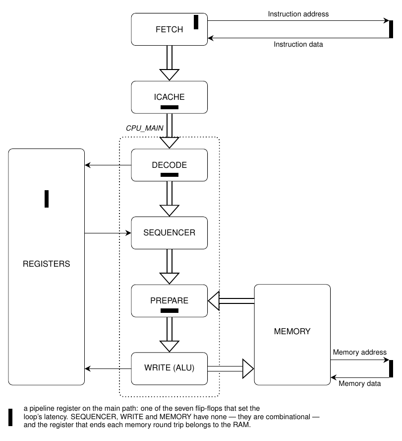

# The main QNICE pipeline

This is a detailed design description of the main CPU pipeline, particularly
the stages DECODE, PREPARE, and WRITE.

Table of contents:
* [Block diagram](#Block-diagram)
* [Microcoding of instructions](#Microcoding-of-instructions)
* [External interfaces](#External-interfaces)
* [Internal interfaces](#Internal-interfaces)
* [Stages](#Stages)
* [Bypass](#Bypass)
* [Pipeline flush](#Pipeline-flush)
* [Formal verification](#Formal-verification)

## Block diagram



The remaining blocks are described else-where, see [main
documentation](../../doc/README.md#Detailed-design-description).

The three stages DECODE, PREPARE, and WRITE are combined into a single module
`cpu_main`. This is mainly to simplify the formal verification.

## Microcoding of instructions

The really cool feature of this implementation is the conversion from the
CISC-like QNICE instructions to more RISC-like micro-operations. This
conversion is done dynamically, i.e. on-the-fly by the DECODE stage with the
help of a small ROM containing micro-code for the various instruction types.

The main purpose of this micro-coding is to reduce the complexity of the
implementation. The complexity arises from the advanced addressing modes,
particularly the fact that each instruction performs up to three memory
operations. For instance, the instruction `ADD @R0, @R1` performs a read from
`@R0`, then a read from `@R1`, and finally a write to `@R1`.  It is these three
memory operations that are "serialized" by the micro-coding. In other words,
each micro-operation performs at most one memory operation (read or write).

So to perform this translation we must essentially classify each instruction
depending on which (if any) memory operations it performs. This is done
primarily by examining the addressing mode of the source and destination
operand.

Note that this microcoding only concerns with splitting up the memory
operations. Therefore, any optional pre- or post-increment of the registers has
no influence on the micro-coding. Pre- and post-increment of registers is
instead handled by the WRITE stage.  This once again simplifies the design
since we here need only to distinguish between pure register addressing mode
against any of the three memory adressing modes.

With the above we have classified the instructions into four classes:
|  Instruction  | # of operations | Which operations                                                                    |
|  -----------  | --------------- | ----------------                                                                    |
| `INST  R,  R` |   1 operation   | Write to register.                                                                  |
| `INST  R, @R` |   2 operations  | Read from destination memory, write to destination memory.                          |
| `INST @R,  R` |   2 operations  | Read from source memory, write to register.                                         |
| `INST @R, @R` |   3 operations  | Read from source memory, read from destination memory, write to destination memory. |

Here `INST` is a general instruction like e.g. `ADD`.

I should note that some instructions don't have two operands. This includes
the Control instructions and the Jump instructions. These are treated
separately.

We could stop here with the micro-coding, but I've added several optimizations
to the above scheme.

### First optimization
First of all, some instructions don't need to read from destination memory.
This is e.g. the `MOVE` instruction.  Likewise, other instructions don't need
to write to destination memory. This is e.g. the 'CMP' instruction.  So we have
additional optimized versions for these instructions:
|  Instruction  | # of operations | Which operations                                                                    |
|  -----------  | --------------- | ----------------                                                                    |
| `MOVE  R,  R` |   1 operation   | Write to register.                                                                  |
| `MOVE  R, @R` |   1 operation   | Write to destination memory.                                                        |
| `MOVE @R,  R` |   2 operations  | Read from source memory, write to register.                                         |
| `MOVE @R, @R` |   2 operations  | Read from source memory, write to destination memory.                               |

|  Instruction  | # of operations | Which operations                                                                    |
|  -----------  | --------------- | ----------------                                                                    |
|  `CMP  R,  R` |   1 operation   | Update Status Register.                                                             |
|  `CMP  R, @R` |   2 operations  | Read from destination memory, update Status Register.                               |
|  `CMP @R,  R` |   2 operations  | Read from source memory, update Status Register.                                    |
|  `CMP @R, @R` |   3 operations  | Read from source memory, read from destination memory, update Status Register.      |

Note that even though the `CMP` instruction does not need to write to memory,
it still expands to the same number of micro-operations. This is because we
need one micro-operation to wait for the result read back from memory.

### Second optimization
Another optimization is that I treat immediate operands as a special case. An
immediate operand is encoded as `@R15++` in the instruction, but there is no need
to perform a read from memory in this case, because the value is already given
by the FETCH module.

What about instructions with `@R15++` in both operands, e.g. `ADD @R15++,
@R15++`?  The FETCH module only provides the first immediate operand.
Therefore, the second immediate operand is handled using a regular memory read.

Furthermore, other addressing modes involving the Program Counter, i,e. `@R15`
and `@--R15` are not optimized and instead handled as any other memory
operation. Note that `@--R15` will decrement the Program Counter, which in turn
(as described below) will be interpreted as a jump instruction.

### Pre- and post-increment
Special care must be taken when handling instructions like `ADD @R0++, @R0++`
since both the source and destination operands refer to the same register, and
this register is updated in both operands. It is therefore essential that the
source register is updated before issuing the read for the destination operand.

### Description of micro-operations
Each micro-operation consists of an array of 12 bits with the following meaning:

| Micro-operation |  Explanation                                               |
| --------------- | ---------------                                            |
|  `LAST`         | Indicates the last micro-operation for this instruction.   |
|  `REG_MOD_SRC`  | Optionally modify source register (`@R++` or `@--R`).      |
|  `REG_MOD_DST`  | Optionally modify destination register (`@R++` or `@--R`). |
|  `MEM_WAIT_SRC` | Wait for source operand from memory.                       |
|  `MEM_WAIT_DST` | Wait for destination operand from memory.                  |
|  `REG_WRITE`    | Write to destination register.                             |
|  `MEM_READ_SRC` | Read from memory to source.                                |
|  `MEM_READ_DST` | Read from memory to destination.                           |
|  `MEM_WRITE`    | Write to destination memory.                               |

Each of the three register operations (`REG_MOD_SRC`, `REG_MOD_DST`, and
`REG_WRITE`) work by issuing a write command to the Register file. Therefore,
they are mutually exclusive and at most one of these bits may be set.

The same applies to the three memory operations (`MEM_READ_SRC`,
`MEM_READ_DST`, and `MEM_WRITE`).

### Examples

Here I'll show a detailed description of some example instructions.

We'll start with a simple `MOVE R0, R1`. Since this instruction has no memory operations at all,
it simplifies to the following:
| Micro-operation |  One  |  Two  | Three |
| --------------- | ----- | ----- | ----- |
| `LAST         ` |   X   |       |       |
| `REG_MOD_SRC  ` |       |       |       |
| `REG_MOD_DST  ` |       |       |       |
| `MEM_WAIT_SRC ` |       |       |       |
| `MEM_WAIT_DST ` |       |       |       |
| `REG_WRITE    ` |   X   |       |       |
| `MEM_READ_SRC ` |       |       |       |
| `MEM_READ_DST ` |       |       |       |
| `MEM_WRITE    ` |       |       |       |

The instruction uses only one micro-operation.

An instruction like `MOVE @R0, @R1` requires two micro-operations:
| Micro-operation |  One  |  Two  | Three |
| --------------- | ----- | ----- | ----- |
| `LAST         ` |       |   X   |       |
| `REG_MOD_SRC  ` |   X   |       |       |
| `REG_MOD_DST  ` |       |   X   |       |
| `MEM_WAIT_SRC ` |       |   X   |       |
| `MEM_WAIT_DST ` |       |       |       |
| `REG_WRITE    ` |       |       |       |
| `MEM_READ_SRC ` |   X   |       |       |
| `MEM_READ_DST ` |       |       |       |
| `MEM_WRITE    ` |       |   X   |       |

* The first micro-operation issues a memory read to source operand and
  simultaneously (optionally) updates the source register. This latter
  operation has no effect for this particular instruction.
* The second micro-operation waits for the source operand to be read from
  memory, issues a write to destination memory, and optionally updates the
  destination register

An instruction like `ADD @R0, @R1` performs three memory instructions:
| Micro-operation |  One  |  Two  | Three |
| --------------- | ----- | ----- | ----- |
| `LAST         ` |       |       |   X   |
| `REG_MOD_SRC  ` |   X   |       |       |
| `REG_MOD_DST  ` |       |       |   X   |
| `MEM_WAIT_SRC ` |       |       |   X   |
| `MEM_WAIT_DST ` |       |       |   X   |
| `REG_WRITE    ` |       |       |       |
| `MEM_READ_SRC ` |   X   |       |       |
| `MEM_READ_DST ` |       |   X   |       |
| `MEM_WRITE    ` |       |       |   X   |

* The first micro-operation again issues a read to source operand and
  simultaneously (optionally) updates the source register, in case it is needed
  by the destination operand.
* The second micro-operations just issues a read to destination operand. Note
  that here the destination register is not updated, because the same value
  will be used during the memory write in the next micro-operation.
* The third and last micro-operation optionally updates the destination
  register, waits for both memory operands to be ready, and writes the result
  back to memory.

The PREPARE stage uses the `MEM_WAIT_SRC` and `MEM_WAIT_DST` microoperations to
control the flow through the pipeline. If any memory read operations have been
performed, the PREPARE stage waits for the read operations to be complete.

The WRITE stage uses the remaining microoperations to control the Memory and
Register modules.

### Waveforms
TBD: Show here a waveform of the four stages working with a given sequence of
instructions, or just a single instruction like `ADD @R0++, @R0++`.  This
waveform should show the bypass operation needed for updating `R0`.

## External interfaces
In the following I'll describe in detail the interfaces to the various
surrounding blocks.

### From FETCH to DECODE
```
fetch_valid_i  : in  std_logic;
fetch_ready_o  : out std_logic;
fetch_double_i : in  std_logic;
fetch_addr_i   : in  std_logic_vector(15 downto 0);
fetch_data_i   : in  std_logic_vector(31 downto 0);
fetch_double_o : out std_logic;
```
This AXI-interface accepts one or two words from the FETCH module. The signal
`fetch_double_i` from the FETCH module indicates whether the signal
`fetch_data_i` contains one or two words.
Correspondingly, the signal `fetch_double_o` back to the FETCH module indicates
whether we wish to consume one or two words.

The idea behind this is that some instructions contain an immediate operand.
Transferring two words (i.e. instruction and immediate operand) simultaneously
greatly simplifies the implementation of the DECODE stage.  Furthermore, this
allows [interleaving](../../doc/README.md#Interleaving) of consecutive
instructions resulting in higher performance.

The instruction is always present in bits 15-0 and any immediate operand (or
possibly the next instruction) is optionally present in bits 31-16. The signal
`fetch_addr_i` contains the address (i.e. Program Counter) of the instruction.

It is here worth noting that even though the Register module contains all the
CPU registers, the Program Counter (`R15`) is instead stored in the FETCH
module and forwarded through the pipeline as a separate signal.

### From DECODE to Register
```
reg_rd_en_o   : out std_logic;
reg_src_reg_o : out std_logic_vector(3 downto 0);
reg_src_val_i : in  std_logic_vector(15 downto 0);
reg_dst_reg_o : out std_logic_vector(3 downto 0);
reg_dst_val_i : in  std_logic_vector(15 downto 0);
reg_r14_i     : in  std_logic_vector(15 downto 0);
```
The DECODE stage reads from the Register module. Note that the values read back
(in `reg_src_val_i` and `reg_dst_val_i`) are valid on the following clock
cycle. I.e. there is a fixed one-clock-cycle latency.

We could have used the standard AXI-interface with `VALID` and `READY` signals,
but since the latency is constant, I've chosen not to. However, we do need the
signal `reg_rd_en_o` because when back-pressure is received from the PREPARE
stage, we don't want to issue new read requests, i.e. we don't want the values
`reg_src_val_i` and `reg_dst_val_i` to change.

The signal `reg_r14_i` always returns the current value of the Status Register
`R14`. This is needed in the WRITE stage for the ALU and for conditional
branching.

### From WRITE to Register
```
reg_we_o     : out std_logic;
reg_addr_o   : out std_logic_vector(3 downto 0);
reg_val_o    : out std_logic_vector(15 downto 0);
reg_r14_we_o : out std_logic;
reg_r14_o    : out std_logic_vector(15 downto 0);
```

The WRITE stage calculates a new value for the destination register and
simultaneously a new value for the Status Register `R14`. There is a separate
Write-Enable for the destination and status registers. There is no support for
back-pressure, simply because the Register file always accepts and performs a
write.

### From WRITE to Memory
```
mem_req_valid_o : out std_logic;
mem_req_ready_i : in  std_logic;
mem_req_op_o    : out std_logic_vector(2 downto 0);
mem_req_addr_o  : out std_logic_vector(15 downto 0);
mem_req_data_o  : out std_logic_vector(15 downto 0);
```
It is the WRITE stage that issues both read and write requests to the Memory
module. This is because the DECODE stage generates micro-operations that each
perform at most one memory operation.

This interface is closely linked together with how the [Wishbone
interface](../../doc/README.md#Wishbone) works and how the [Memory
module](../memory/README.md) is designed.

Note that we have the standard AXI-interface controlling when the Memory module
accepts a transaction request (read or write). The type of request is
controlled by the one-hot-encoded `mem_req_op_o` signal:
* Bit 2 : Read from memory and store in Source buffer.
* Bit 1 : Read from memory and store in Destination buffer.
* Bit 0 : Write to memory.

Exactly one of these three bits must be set for any transaction.

Since all memory transactions are controlled by the same stage (WRITE), this
greatly simplifies the Memory module. Correspondingly, since the Memory module
contains buffers for both Source and Destination operands, this greatly
simplifies the PREPARE module, see below.

### From Memory to PREPARE
```
mem_src_valid_i : in  std_logic;
mem_src_ready_o : out std_logic;
mem_src_data_i  : in  std_logic_vector(15 downto 0);
mem_dst_valid_i : in  std_logic;
mem_dst_ready_o : out std_logic;
mem_dst_data_i  : in  std_logic_vector(15 downto 0);
```

The PREPARE module receives optionally a Source and/or a Destination operand
from the Memory module. The interface uses two parallel AXI-interfaces, which
again significantly simplifies the PREPARE stage.


### From WRITE to FETCH
The interfaces described so far work for almost all instructions and
addressing modes.  However, during branches the Program Counter `R15` inside
the FETCH module must be updated. This is controlled by the following two
signals generated by the WRITE stage.
```
fetch_valid_o : out std_logic;
fetch_addr_o  : out std_logic_vector(15 downto 0);
```
These are not separate signals but are decoded directly from the register write
port: `fetch_valid_o` is asserted whenever WRITE writes to register 15, and
`fetch_addr_o` is that write value. The same `fetch_valid_o` also flushes the
pipeline, see [Pipeline flush](#Pipeline-flush) below.

### Halt
```
halt_o : out std_logic;
```
This output is asserted for one clock cycle when a `HALT` instruction retires,
i.e. it is `inst_done_o` qualified by the instruction being `CTRL HALT`. `HALT`
has no architectural effect inside `cpu_main`; all this does is tell the outside
world that the program has run to completion.

Acting on it is [cpu.vhd](../cpu.vhd)'s job, and it does so at the *other* end
of the pipeline: `p_halt_fetched` there watches the Icache-to-DECODE handshake
and gates it off as soon as a `HALT` is handed to DECODE, so that the `HALT` is
the last instruction to enter the pipeline. Gating on `halt_o` itself would be
too late — the next one or two instructions have already been accepted by then,
and would retire after the `HALT`, executing whatever data follows it in memory.
That gate is cleared again by a pipeline flush, because a `HALT` that DECODE has
accepted is not necessarily a `HALT` that will execute: an older branch retiring
discards it. `test/prog_pipeline.asm` branches over twelve `HALT`s used as
padding and depends on this.

`halt_o` is also the end-of-test event for `test/test_monitor.vhd`, see
[test/README.md](../../test/README.md).

### Debug
```
inst_done_o : out std_logic;
```
This output is asserted for one clock cycle whenever the WRITE stage accepts the
micro-operation marked `LAST`, i.e. once per completed instruction. It is not
used by the CPU itself; it drives the instruction counter in the testbench and
gates the call to the `disassemble` procedure inside a `pragma synthesis_off`
block in [write.vhd](write.vhd).

## Internal interfaces
This section describes the interfaces interfaces between the three stages
DECODE, PREPARE, and WRITE.

The interface from DECODE to PREPARE, and from PREPARE to WRITE is a standard
AXI-interface accompanied by the following record data structure:
```
type t_stage is record
   microcodes  : std_logic_vector(35 downto 0);
   addr        : std_logic_vector(15 downto 0);
   inst        : std_logic_vector(15 downto 0);
   immediate   : std_logic_vector(15 downto 0);
   src_addr    : std_logic_vector(3 downto 0);
   src_mode    : std_logic_vector(1 downto 0);
   src_val     : std_logic_vector(15 downto 0);
   src_imm     : std_logic;
   dst_addr    : std_logic_vector(3 downto 0);
   dst_mode    : std_logic_vector(1 downto 0);
   dst_val     : std_logic_vector(15 downto 0);
   dst_imm     : std_logic;
   res_reg     : std_logic_vector(3 downto 0);
   r14         : std_logic_vector(15 downto 0);
   alu_oper    : std_logic_vector(3 downto 0);
   alu_ctrl    : std_logic_vector(5 downto 0);
   alu_flags   : std_logic_vector(15 downto 0);
   alu_src_val : std_logic_vector(15 downto 0);
   alu_dst_val : std_logic_vector(15 downto 0);
end record t_stage;
```

The element `microcodes` carries the whole list of up to three 12-bit
micro-operations produced by the microcode ROM (3 x 12 = 36 bits). The Sequencer
in the PREPARE stage presents them one at a time by overwriting bits 11-0 with
the selected chunk, so from PREPARE onwards the micro-operation to be performed
is in bits 11-0. The upper bits still hold the raw, unselected list and must not
be consumed downstream.

The elements `addr`, `inst`, and `immediate` are the address, instruction, and
immediate operand passed on from the FETCH module.

The flags `src_imm` and `dst_imm` indicate whether the source or destination
operand should use the immediate value passed on.

The elements `src_addr`, `src_mode`, and `src_val` indicate the source register
number, the source operand addressing mode, and the source register value (from
Register module). Similarly for the destination register.

The element `res_reg` indicates which register to write the result back into.
It equals the destination register for all ordinary instructions. The exception
is the jump instructions, where DECODE forces `res_reg` to `R15` so that the
branch target lands in the Program Counter. For the subroutine variants
(`ASUB`/`RSUB`) the destination register is at the same time rewritten to `R13`
with pre-decrement addressing, so that the return address is pushed onto the
stack while `res_reg` still points at `R15`.

Finally, `r14` contains the current value of the Status Register.

**Not every element is latched.** DECODE registers `microcodes`, `addr`, `inst`,
`immediate`, `src_addr`, `src_mode`, `src_imm`, `dst_addr`, `dst_mode`,
`dst_imm` and `res_reg` in its output process, but `src_val`, `dst_val` and
`r14` are *concurrent* assignments straight from the register file read ports.
They therefore keep moving while DECODE is stalled, and that is deliberate: it
is how a stalled instruction picks up a register or Status Register write issued
by the older instruction still in WRITE, and how the second micro-op of
`ADD @R0++, @R0++` sees the `R0` update made by the first. The consumer only
ever samples them at the moment it accepts a beat, so their movement in between
is harmless. Freezing them would silently reintroduce stale-operand hazards.

The remaining elements `alu_*` are only used from PREPARE to WRITE. They contain
all the values needed by the ALU.

## Stages

### DECODE
The main back-bone of the DECODE stage is the micro-code ROM implemented in the
file [microcode.vhd](sub/microcode.vhd). The entry to this ROM is a four-bit
signal describing the classification of the current instruction. This
classification is encoded in the following four bits:
* `reads_from_dst` : The instruction wants to read from the destination operand.
* `writes_to_dst`  : The instruction wants to write to the destination operand.
* `src_memory`     : The source operand belongs in memory.
* `dst_memory`     : The destination operand belongs in memory.

The latter two bits are de-asserted in the special case of `@R15++`.

The microcode ROM returns (combinatorially) a list of up to three
micro-operations, packed into the 36-bit `microcodes` element of `t_stage`.
DECODE forwards that entire list in a single beat; it is the
[Sequencer](sub/sequencer.vhd) in the **PREPARE** stage that splits (sequences)
it into separate clock cycles.

This implies a contract between the two stages: the `LAST` bit must be set no
later than the top (third) chunk of the list. The Sequencer derives its chunk
index range from the width of `microcodes`, so a fourth chunk would index past
the end of the list. Every entry of the microcode ROM, and every one of the jump
overrides in [decode.vhd](decode.vhd), sets `LAST` in the top chunk. The
contract is stated in the header of [sequencer.vhd](sub/sequencer.vhd) and
assumed in `formal/sequencer.psl`.

One additional complexity handled by the DECODE module is the special case of
jump instructions (`ABRA`, `RBRA`, `ASUB`, and `RSUB`).

### PREPARE

#### Reading R15

The working Program Counter lives in the FETCH stage. The register file does
hold an `R15`, but it is only written when an instruction actually targets
`R15` — i.e. on branches — so during sequential execution it is stale and must
never be used as an operand value.

PREPARE therefore substitutes the real PC into `src_val`/`dst_val` before
anything downstream sees them (`src_val_pc`/`dst_val_pc` in
[prepare.vhd](prepare.vhd)). Doing the substitution on the stage record, rather
than only on the ALU inputs, matters because the WRITE stage derives two other
things from `src_val`/`dst_val`: the memory address for `@R15` and `@--R15`,
and the pre/post-increment write-back. All three have to agree.

The substituted value is the address of the next word to be fetched at the
point the operand is read, matching `qnice.c`, which advances a single PC
register immediately after the instruction fetch and then reads both operands
through it:

| Operand | Value |
| ------- | ----- |
| source `R15` | `addr+1` always — an immediate belongs to the destination, and is fetched only after the source has been read |
| destination `R15` | `addr+2` when the source was an immediate (that fetch has already advanced the PC), otherwise `addr+1` |

`@R15++` never reaches this logic: DECODE flags it as an immediate and FETCH
supplies the value inline.

Because this is the value of the register itself, it applies in every
addressing mode. `test/prog_r15.asm` covers the source path, the destination
path, and `@R15`; `CMP R15, R15` is a useful differential check, since it must
set `Z` only if the two paths agree.

#### Sequencing

This stage holds the [Sequencer](sub/sequencer.vhd), which expands the single
beat received from DECODE into one beat per micro-operation. The Sequencer adds
no latency (it is combinatorial in the forward direction), but it holds its
`s_ready_o` low until the chunk marked `LAST` has been accepted downstream. That
is the first of the two sources of back-pressure towards FETCH. The second is
the wait for memory read data, expressed by the `MEM_WAIT_SRC` and
`MEM_WAIT_DST` micro-operations.

Apart from that, this stage is quite small and mainly serves the function of
adding some flip-flops in an otherwise very long combinatorial path. In other words, this
stage almost halves the longest combinatorial delay thus essentially doubling
the maximum frequency. However, the cost is increased data hazards due to a
longer pipeline, and therefore additional bypass handling is needed, as well as
occasional pipeline stalls.

### WRITE
This stage contains the ALU and writes result back to the Register or Memory
module.  Additionally, it handles pre- and post-increment of the registers.

## Bypass

> This logic is exercised by simulation: `test/prog_hazard.asm` drives
> read-after-write hazards between adjacent instructions.

Whenever one has a pipelined architecture, where later stages write back to
storage (i.e. register file) that is read in an earlier stage, we have a
potential data hazard. In other words, we need to ensure that the register
values read in the DECODE stage are not stale compared to the values written in
the WRITE stage. In this design that is handled entirely inside the Register
module; `cpu_main` itself carries no bypass logic, which is less obvious than it
sounds and is explained below.

### Write-before-read in the Register module
The Register module resolves the common case itself: a write from the WRITE
stage that coincides with a read from the DECODE stage returns the newly written
value rather than the stale one. This is a combinational bypass built into the
register file, described in
[registers/README.md](../registers/README.md#Operation). No action is needed in
`cpu_main` for this case.

### Why the WRITE stage needs no Status Register bypass

The WRITE stage both consumes and produces the Status Register within the same
instruction, so it looks like it should need a bypass of its own — and it used
to have one: a `p_bypass` process holding a one-cycle-delayed copy of everything
this stage wrote to the Register module, feeding a priority mux in front of
`prep_stage_i.r14`.

That was removed as dead code. A probe on it never fired once in 8286 accepted
beats of `test/prog.asm`, and removing it left every test program passing with
the golden writes logs (`test/*.writes.golden`) byte-identical. The reason is
structural, and worth understanding before anyone adds it back:

* `registers.vhd` forwards **both** Status Register write ports combinationally
  onto `sr_val_o` (see
  [registers/README.md](../registers/README.md#Write-Before-Read-on-the-dedicated-SR-port)).
* DECODE passes `reg_r14_i` through as a *live*, unregistered signal — see the
  note on latched versus live elements under
  [Internal interfaces](#Internal-interfaces).
* WRITE only ever issues a register write on a cycle where PREPARE is
  simultaneously latching a fresh beat, because both are gated by the same
  ready signal.

Put together: the `r14` value arriving at WRITE has already absorbed any write
WRITE itself made. `prep_stage_i.r14` is therefore used directly, and it feeds
only the conditional-branch decision (`update_reg`). The ALU takes its flags
from `prep_stage_i.alu_flags`, which PREPARE latched from the same source in the
same cycle — the two are always bit-identical.

## Pipeline flush
Any update of the Program Counter invalidates whatever DECODE and PREPARE have
already speculatively fetched and decoded from the fall-through path. Rather
than adding a separate flush signal, `cpu_main` reuses `fetch_valid_o`: in
[cpu_main.vhd](cpu_main.vhd) the DECODE and PREPARE instances are reset with
`rst_i or fetch_valid_o`, while WRITE gets the plain `rst_i`.

So every branch, and every other write to `R15`, clears the two upstream stages
in the same cycle that the new PC is handed to FETCH. The WRITE stage is
deliberately not flushed, since it is the stage producing the branch and must be
allowed to complete the instruction that caused it.

This also covers the exit from reset. While `rst_i` is asserted, the `p_reg`
process in [write.vhd](write.vhd) forces a write of `R15 = 0`, which in turn
asserts `fetch_valid_o` and so starts execution from address 0 with a clean
pipeline.

## Formal verification
`formal/cpu_main.psl` verifies the assembled DECODE + PREPARE + WRITE pipeline
against a free (unconstrained) environment for FETCH, the Register module and
the Memory module. The environment assumptions model the valid/ready contract on
each interface, the fixed one-cycle read latency of the Register module, and the
fact that at most one source and one destination read may be outstanding
towards the Memory module at a time.

The assertions fall into three groups:

* **Internal handshakes.** `f_dec2prep_valid_stable` and `f_prep2wr_valid_stable`
  check that the payload and valid of each internal stage interface hold stable
  while stalled. Both carry an explicit `not fetch_valid_o` escape clause,
  because a pipeline flush (see above) legitimately drops valid mid-transfer.
  `f_dec2prep_valid_stable` enumerates the eleven *latched* elements of
  `t_stage` rather than asserting `stable()` over the whole record, because
  `src_val`, `dst_val` and `r14` are live pass-throughs (see
  [Internal interfaces](#Internal-interfaces) above). `f_dec2prep_live_src` /
  `_dst` / `_r14` assert the complementary fact — that those three really are
  pure pass-throughs — so that registering one by mistake is caught too.
  `c_dec2prep_stalled` and `c_dec2prep_stalled_sr` cover the stall condition,
  and the stall-with-SR-write case in particular, to show the stability
  assertion is not vacuous.
* **Output interfaces.** `f_fetch_double` checks that we never accept a single
  word when we need two; `f_mem_src_ready_stable` / `f_mem_dst_ready_stable`
  check the ready signals towards the Memory module; `f_r14_bit0` checks the
  QNICE invariant that bit 0 of the Status Register always reads back as `1`.
* **Instruction behaviour.** `f_mov_r_r_read` and `f_mov_r_r_write` are the two
  properties that reason about an actual instruction. Using `anyconst`
  source/destination register numbers, they assert that accepting a
  `MOVE Rs, Rd` (with `Rs /= R15`) issues the matching register read in that
  same cycle, and that whenever such a MOVE *completes* in WRITE it writes `Rd`
  with the value read for `Rs`, updates the flags, and issues no memory request.
  `c_mov_read`, `c_mov_write`, `c_mov_write_pc` and `c_mov_write_gp` cover both
  triggers, including the `Rd = R15` case where the MOVE doubles as a jump.

  These two replace an earlier single property of the shape
  `{accepted} |-> {read; true[*]; completion}`, which was **vacuous past its
  first term**: `true[*]` is an unbounded SERE repetition, so on a finite BMC
  trace the tail is always merely "pending" rather than violated. Inverting the
  written value, corrupting the written address, and suppressing the register
  write altogether all went undetected; only the read term had any effect.
  Bounding the repetition is not an option either, because the completion
  latency is genuinely unbounded — a preceding load stalls the pipeline until
  `mem_src_valid_i` arrives, and nothing forces a response ever to arrive. The
  eventuality is therefore dropped rather than faked: neither property claims
  the instruction eventually completes, which is liveness and out of reach for
  BMC anyway.

  Note also what the environment does *not* cover: the assumption tying reads of
  `c_src_reg` to the constant `c_src_val` models that register as never
  changing, so traces where the design writes to it are excluded from every
  property in the file.

The Sequencer is additionally verified standalone in `formal/sequencer.psl`,
where `prove` (k-induction) passes: output valid is a pure pass-through of input
valid, the payload is stable while stalled, no new DECODE beat is accepted
before the `LAST` chunk has been accepted, and the chunk index advances,
restarts and holds correctly. The `LAST`-in-the-top-chunk contract described
under [DECODE](#DECODE) is an *assume* there, not an assert - it is a
requirement on the microcode ROM, not a property of the Sequencer.

**Status.** `cpu_main.sby` defines a `cover` and a `bmc` task, both at depth 20.
Both pass, and the assertions are mutation-tested: corrupting the register read
address, the register write address, the written value, or the write enable each
produces a failure. (They also pass at depth 30, which takes about 40 seconds; depth 20
runs in under ten.) K-induction (`prove`) is not attempted for `cpu_main`.

`bmc` used to fail at depth 4 on `f_dec2prep_valid_stable`. That was a defect in
the property, not in the RTL: it asserted `stable()` over the entire `t_stage`
record, including the three live pass-through elements, so BMC found a trace
where `reg_r14_i` changed on the cycle after `reg_r14_we_o` was asserted while
DECODE was stalled — legitimate bypass behaviour. The property now enumerates
the latched elements only.
