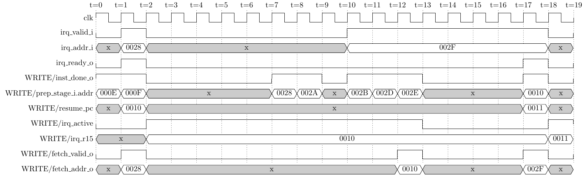

# Interrupt daisy-chain interface

This directory will hold `interrupt.vhd`, the leaf module that hides the QNICE
`INT_N`/`IGRANT_N` daisy-chain protocol behind a plain handshake to WRITE.

**Status: specification, not description.** The module does not exist yet — this
is task T2 of [doc/interrupts.md](../../doc/interrupts.md), and the diagram below
is task T2b, drawn ahead of it because the bus protocol was the part of the
feature the upstream sources disagreed about most. Everything here is what T2 has
to implement, and what `formal/interrupt.psl` has to check. Redraw the diagram
against a real GHDL simulation once the module runs, exactly as
[src/cpu_main/timing.tex](../cpu_main/timing.tex) is read off
`test/prog_waveform.asm`.

## The diagram

One hardware interrupt taken to completion, followed by a second request that
arrives while the ISR is still running and is therefore made to wait. Rendered
from [timing.tex](timing.tex) by `make diagrams`.

## Ports

| Port | Dir | Kind | Meaning |
|---|---|---|---|
| `int_n_i` | in | pin, active low | A device is requesting an interrupt. |
| `igrant_n_o` | out | pin, active low, **registered** | Committed; take the bus this cycle. |
| `isr_addr_i` | in | pins, 16 bit | The ISR address. Valid in the granted cycle. |
| `pending_o` | out | **registered** | A request is waiting and the module is idle. |
| `start_i` | in | combinational | One-cycle commit pulse from WRITE. |
| `done_o` | out | **registered**, one cycle | `addr_o` now holds a captured ISR address. |
| `addr_o` | out | **registered**, held | The captured ISR address. |

`isr_addr_i` is a port of its own rather than the data Wishbone; the reasoning is
in [doc/interrupts.md](../../doc/interrupts.md#bus-protocol).

`int_n_i` and `isr_addr_i` are assumed **synchronous to `clk_i`** — the daisy
chain is a synchronous bus and every device on it shares the CPU clock. A device
in another clock domain must synchronise on its own side, because a 16-bit
address cannot be brought across a domain boundary by a flip-flop chain. The
single flip-flop behind `pending_o` is there to keep an external pin out of
WRITE's combinational logic, not as a CDC synchroniser.

## Walking the diagram

* **t=1** A device pulls `int_n_i` low. The CPU is mid-instruction, and nothing
  happens yet. A device may hold this low indefinitely; it must tolerate waiting
  arbitrarily long. It does **not** drive `isr_addr_i` — it has no bus yet.
* **t=2** `pending_o` rises, one cycle later, because it is registered.
* **t=3** `inst_done_o` and `pending_o` are both high and `int_active` is low, so
  WRITE pulses `start_i`. **This is the commit point**: on this edge WRITE
  latches `R14` and `next_pc`, sets `int_active`, and raises `int_wait`. Once
  committed, the CPU cannot back out — there is no way to abort a request.
* **t=4** **The transfer.** `igrant_n_o` goes low for exactly one cycle. The
  device drives `isr_addr_i` combinationally in that same cycle, while still
  holding `int_n_i` low. Both lines low is the handshake — see
  [The handshake is one cycle](#the-handshake-is-one-cycle) — and the module
  captures `isr_addr_i` on the edge that ends the cycle.
* **t=5** `igrant_n_o` returns high, `done_o` pulses, `addr_o` holds the address.
  WRITE asserts `fetch_valid_o` in this same cycle, redirecting FETCH to the ISR,
  and drops `int_wait`. The device sees the grant released, stops driving the bus,
  and raises `int_n_i`; the CPU already has the address in a register and no
  longer watches either.
* **t=6** The first ISR instruction is on its way. Total cost from commit to
  redirect: **two cycles**, on top of the redirect penalty a taken branch pays
  anyway.
* **t=7** A device requests again, inside the ISR. `pending_o` rises at t=8, but
  `int_active` is high, so `start_i` never does — visibly so at t=8, where an ISR
  instruction retires with a request pending and no grant follows.
* **t=10** `RTI` retires. `int_active` clears on this edge and `fetch_valid_o`
  redirects FETCH to the restored PC. `start_i` stays low **during** t=10,
  because `int_active` is still high for the whole of that cycle.
* **t=11** `int_active` is low and the request is still pending, but
  `inst_done_o` is low — the instruction at the return address is still in
  flight. The second grant follows at the next instruction boundary.

## The handshake is one cycle

Read the two pins as an inverted AXI-style handshake: `VALID` is `int_n_i` low,
`READY` is `igrant_n_o` low, and the transfer happens in the single cycle both
are low. That is t=4, and it is the only cycle in which `isr_addr_i` means
anything.

The CPU never waits inside the grant, because it only ever asserts `READY` when
`VALID` is already asserted and known to stay so: the device holds its request
until granted, so the transfer cycle *is* the grant cycle by construction. That
makes `int_n_i` low during the grant an **assertion rather than a condition** —
a device that dropped its request between the commit and the grant is now a
detectable protocol violation. Under the older three-cycle scheme it was not:
there, `int_n_i` going high during the grant was the data-valid signal, so an
early release and a valid address looked identical.

Two things keep this from being literally AXI, both forced by the daisy chain:

* **The data is not valid whenever `VALID` is.** A device cannot drive
  `isr_addr_i` when it asserts `int_n_i`, only when it is granted, because the
  address lines are shared by the whole chain and a device is not alone in
  requesting. A requester de-couples only its right neighbour's *grant*
  (`fsm_grant_n_reg <= '1'` in `vhdl/timer.vhd`), not its request, so devices
  further right are free to fire while a transaction is in progress. If they
  drove the address at the same time, they would collide with the granted
  device. The grant is what resolves that, which is why it has to precede the
  data.
* **`VALID` drops one cycle after the transfer, not at it.** `int_n_i` is still
  low during t=4 and only rises at t=5. Nothing reads it there.

## Tighter than upstream, and by exactly how much

Upstream's prose contract is looser than the one above.
[`doc/int-device.md`](https://github.com/sy2002/QNICE-FPGA/blob/dev-V1.61/doc/int-device.md)
says "as soon as the ISR address data that the device put on the data bus is
valid, the device pulls `INT_N` back to `1`", and `doc/intro/interrupt_timing.jpg`
draws the data becoming valid *after* the grant falls. The reference CPU
implements exactly that: `cs_int_wait_isr` in `vhdl/qnice_cpu.vhd` spins until
`INT_N = '1'` and only then latches `DATA_IN`. So upstream lets a device take any
number of cycles between grant and valid data, and this CPU allows it none.

The reference *device* the same document points at, however, already meets the
tighter rule. `fsm_output_decode` in `vhdl/timer.vhd` is combinational in
`grant_n_in`, and in state `s_signal` the assignment `data_out <= reg_int` happens
in the very cycle it observes `grant_n_in = '0'`, with `int_n_out` still `'0'`.
Only the cycle after — `s_provide_isr` — does it raise `int_n_out`. So the
address really is on the bus during t=4, and the extra cycle the old scheme spent
waiting for `int_n_i` to rise bought nothing.

What the divergence costs: a device that *registers* its address output, driving
it from the cycle after it sees the grant, is conforming upstream and broken
here — this CPU would capture whatever happened to be on the bus at t=4. Any
device targeting this CPU must drive combinationally off the grant.

There is a timing price too. The captured path is now single-cycle: the
`igrant_n_o` flop, the pass-through logic of every device between the CPU and the
requester, the address mux, and the capture flop. Under the old scheme the
address also had the whole of the second granted cycle to settle, so the path was
effectively multicycle. On a long chain at a high clock this is what will fail
first, and the symptom is a wrong ISR address rather than a hang. The fallback, if
it ever does, is to put the wait cycle back and pay for it.

## Three things the diagram settles

**The grant follows the commit; it does not precede it.** The alternative — let
the module run the handshake as soon as `int_n_i` goes low and buffer the address
for WRITE to collect later — would produce the address a cycle or two sooner, and
is wrong. A grant is observable: it tells the requesting device it is being
serviced, and it releases the daisy chain to the next device. Issuing one while
an ISR is still running, or while the CPU has not yet decided to take the
interrupt, breaks the no-nesting rule at the bus level however the CPU behaves
internally. The cost of doing it correctly is the two-cycle stall at t=4..t=5.

**`int_wait` is not optional.** Between the commit at t=3 and the redirect at
t=5, the saved PC is already fixed but DECODE and PREPARE still hold the
instructions that follow it. If one of them retired in that window it would
change architectural state *after* the return address, and `RTI` would replay it.
So WRITE holds its ready to PREPARE low for those two cycles. This is ordinary
back-pressure — the same stall a memory access already applies — not new
machinery. It is a different mechanism from `p_halt_fetched` in `cpu.vhd`, which
gates the ICACHE-to-DECODE handshake instead; gating the feed is not enough here,
because the instructions in question have already been fetched.

**One instruction always runs between two ISRs.** `start_i` is gated on
`int_active`, which is still high during the cycle `RTI` retires, so the earliest
a second interrupt can be granted is the next instruction boundary after the
return. That guarantees forward progress: a device holding `int_n_i` low forever
cannot livelock the CPU into re-entering the ISR without executing anything at
the return address. It is a consequence of the gating rather than a separate
mechanism, but it is a property worth stating and worth a PSL cover.

## The contract

**The device must:**

1. Pull `int_n_i` low to request, and hold it low until granted — including
   through the granted cycle itself.
2. Drive `isr_addr_i` **in the same cycle it observes `igrant_n_o` low**, i.e.
   combinationally off the grant. This is the one place the protocol here is
   tighter than upstream's prose; see the section above.
3. Not drive `isr_addr_i` at any other time. The lines are shared with every
   other device on the chain, and only the grant says whose turn it is.
4. Release the bus and raise `int_n_i` once it observes `igrant_n_o` high again.
   Any cycle at or after that will do.
5. Never interfere with a transaction already in progress further down the
   chain — the pass-through and wait-your-turn rules of
   [`doc/int-device.md`](https://github.com/sy2002/QNICE-FPGA/blob/dev-V1.61/doc/int-device.md)
   upstream, which this CPU does not police.

**The CPU must:**

1. Assert `igrant_n_o` only after committing — `R14` and `R15` saved,
   `int_active` set. The ISA document specifies this ordering explicitly, and it
   is what makes a grant mean "you are being serviced now" rather than "you may
   be serviced eventually".
2. Assert `igrant_n_o` only at an instruction boundary with no ISR active.
3. Hold `igrant_n_o` low for **exactly one cycle**, and capture `isr_addr_i` on
   the edge that ends it. Never wait inside the grant.
4. Redirect FETCH in the cycle after that, off `done_o`.
5. Retire nothing between the commit and the redirect — see `int_wait` above.

## What is deliberately not required

The device does **not** have to release the bus combinationally, and does not
have to raise `int_n_i` on any particular cycle. An earlier draft of
[doc/interrupts.md](../../doc/interrupts.md) required a combinational release, on
the assumption that the CPU would use `isr_addr_i` directly. It does not: the
address is captured into `addr_o` on the edge ending t=4, so from t=5 onward the
bus can take as long as it likes to turn around, and `int_n_i` is no longer read
as a data-valid signal at all. Both weaker rules are what `vhdl/timer.vhd`
already satisfies, and imposing a constraint upstream does not impose would have
made conforming devices non-conforming here for no gain.

## Open for T2

* Reset behaviour. `rst_i` must return the FSM to `IDLE` with `igrant_n_o` high.
  Whether a reset asserted mid-grant needs to do anything for the device beyond
  releasing the grant is an open question — the daisy chain has no reset line.
* `pending_o` must be qualified with "and the module is idle", not just
  "`int_n_i` is low": `pending_r <= '1' when int_n_i = '0' and state = IDLE and
  state_next = IDLE else '0'`. The `state_next` term is what keeps `pending_o`
  from staying high through the commit; the `state` term is what stops the
  granted device's trailing `int_n_i` low at t=4 from raising a phantom
  `pending_o` at t=5. `int_active` would mask that phantom inside WRITE, but a
  formal property phrased on `pending_o` alone would trip over it.
* Whether `pending_o` should distinguish "requesting" from "requesting and
  grantable"; the diagram assumes the former and lets WRITE apply `int_active`.
* `formal/interrupt.{psl,sby,gtkw}`: the contract above is written as five and
  five obligations precisely so that each becomes an assumption or an assertion.
  The device's five are assumptions, the CPU's five are assertions, and the three
  properties in the section above that are covers.
