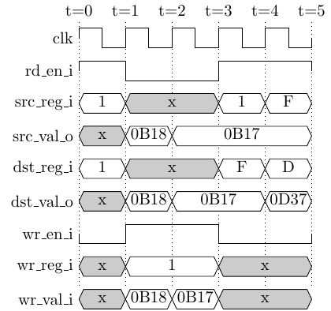
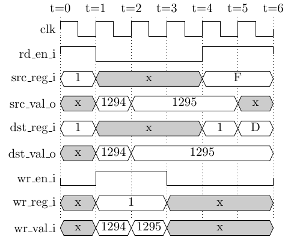

# REGISTERS module

This module contains all the registers in the CPU. It has two read ports
connected to the DECODE stage, and a single write port connected to the WRITE
stage.

The only register that is treated in a special way is the processor Status
Register (R14). This is because this register is usually written to at the end
of each instruction together with any optional register writes.

The Stack Pointer (R13) is treated like a normal register (this is handled in
the DECODE stage). The Program Counter (R15) has a slot in the upper
register bank like any other register, and the WRITE stage writes it whenever an
instruction targets R15 — that is how a branch updates the PC. But it is *not*
the working Program Counter: that resides in the FETCH stage, which increments
it without telling the register file. The R15 slot here is therefore stale
during sequential execution, and must never be used as an operand value; the
PREPARE stage substitutes the real PC instead (see
[cpu_main/README.md](../cpu_main/README.md#Reading-R15)).


## Interface
The top-level interface of the REGISTERS module is as follows:

```
-- Read interface, connected to DECODE stage
rd_en_i     : in  std_logic;
src_reg_i   : in  std_logic_vector(3 downto 0);
src_val_o   : out std_logic_vector(15 downto 0);
dst_reg_i   : in  std_logic_vector(3 downto 0);
dst_val_o   : out std_logic_vector(15 downto 0);
sr_val_o    : out std_logic_vector(15 downto 0);

-- Write interface, connected to WRITE stage
wr_sr_en_i  : in  std_logic;
wr_sr_val_i : in  std_logic_vector(15 downto 0);
wr_en_i     : in  std_logic;
wr_reg_i    : in  std_logic_vector(3 downto 0);
wr_val_i    : in  std_logic_vector(15 downto 0)
```


## Operation

The latency is fixed at one clock cycle. There is a read-enable, which means
that the register address signals `src_reg_i` and `dst_reg_i` are only sampled
when `rd_en_i` is asserted.

This module supports Write-Before-Read, which means that special care is needed
when writing to a register currently (or previously) read. Specifically, if a
register is read from and written to in the same clock cycle (i.e. `rd_en_i`
are `wr_en_i` are both asserted, and `wr_reg_i` is equal to one of `src_reg_i`
or `dst_reg_i`) then the value presented on the next clock cycle is the value
just written.

But furthermore, if a register was read in the previous clock cycle, but
`rd_en_i` is now de-asserted, the output value is still updated in case of a
write. This is shown in the diagram below.



Here we see the execution of the `MOVE @--R1, @R1` instruction.
* In the first clock cycle the DECODE stage reads from register 1.
* In the second clock cycle the result of the read operation (`0AF6`) is
  presented on `src_val_o` and `dst_val_o`. Simultaneously, a write (`0AF5`) is
  being performed to register 1, but no new read is issued.
* In the third clock cycle, despite the lack of a read request, the outputs are
  updated with the new value just written.


Here is another example with a similar behaviour:



This is during execution of the `SUB @R1++, @R1` instruction.  The first cycle
shows a read from register 1, the second cycle shows a write to register 1, and
cycles 3 and 4 both present the new value, despite no read request.

### Bank switching
`R0`-`R7` live in a `2**G_REGISTER_BANK_WIDTH` deep RAM, and the page is
selected by the upper bits of `R14`:

```vhdl
lower_rd_addr_src <= reg_sr(G_REGISTER_BANK_WIDTH+7 downto 8) & src_reg_i(2 downto 0);
```

Note that this is the *registered* `reg_sr`, not the forwarded value that
`sr_val_o` presents. Write-Before-Read therefore does **not** extend to the bank:
a read issued in the same cycle as an `INCRB` still selects the old page.

That is deliberate, and it is safe only because of an invariant maintained
outside this module: when an instruction changes those upper bits, `cpu_main`
guarantees that no read already issued against the outgoing page is ever
*consumed*. It does that by flushing the instruction whose read has already
happened and holding back the one whose read is going out in that very cycle —
and it only has to do either when the instruction concerned actually uses a
banked value. See
[Register bank switch](../cpu_main/README.md#Register-bank-switch) in the
`cpu_main` write-up for the details, including why forwarding the bank here
would not have been enough on its own: the read address reaches the RAM a cycle
before the new bank exists.

The **write** address does not need forwarding either, for a different and
self-contained reason: a lower-bank write requires `wr_reg_i(3) = '0'`, and the
only ways the bank can change are `INCRB`/`DECRB`, which write no
general-purpose register, and an ordinary write to `R14`, which has
`wr_reg_i(3) = '1'` and so leaves `lower_wr_en` deasserted. Every other
`wr_sr_en_i` write is a flag update, which preserves bits 15 downto 8.

That asymmetry — the read address uses the page in force when the read was
*issued*, the write address the page in force when the write *retires* — is what
makes writing a banked register harmless across a bank switch, and it is the
reason `cpu_main` can leave `MOVE R8, R0` unflushed straight after an `INCRB`:
the value arrives carrying only a register number, and lands on the new page.

### Write-Before-Read on the dedicated SR port

`R14` can be written through two different ports: the ordinary write port
(`wr_en_i`/`wr_reg_i`/`wr_val_i`), used when an instruction targets `R14`
explicitly, and the dedicated Status Register port
(`wr_sr_en_i`/`wr_sr_val_i`), used by the WRITE stage to update the flags at the
end of nearly every instruction.

Write-Before-Read applies to **both** ports. Reading `R14` as an ordinary
register — for instance the `MOVE R14, R9` that follows an `ADDC` — must return
the flags that `ADDC` just produced, even though those arrived on the dedicated
port. `src_val_o`/`dst_val_o` therefore forward `wr_sr_val_i` and its delayed
copy `wr_sr_val_d`, exactly mirroring the `wr_val_i`/`wr_val_d` terms that
forward the ordinary port.

Priority within a single cycle matches `p_sr` and `sr_val_o`: the ordinary port
wins over the dedicated SR port, and a same-cycle write wins over the delayed
copy of the previous cycle's write.


## Implementation

The main part of the implementation is the Dual-Port RAM module
[`dp_ram.vhd`](../sub/dp_ram.vhd). The read-enable is propagated to this
sub-module, but the write-before-read functionality must be handled in this
module.

That RAM has two ports: port A reads and port B reads and writes. The register
file uses port A for the read and port B for the write, leaving `G_B_READ`
false so port B's read half is never generated. It gets its *second* read port
— source and destination operands are read in the same cycle — by instantiating
a second copy of the RAM rather than from port B, which cannot help: port B's
address is the write address. The same module, with `G_B_READ` set, is the
testbench memory model; see its header for why it is shaped that way.

Additionally, we must have extra circuitry to disable update of the output when
`rd_en_i` is de-asserted.

The `src_val_o`/`dst_val_o` priority chain is, from highest to lowest:

| # | Term                     | Condition                                            |
| - | ------------------------ | ---------------------------------------------------- |
| 1 | `wr_val_i`               | ordinary write this cycle, to the register being read |
| 2 | `wr_sr_val_i or X"0001"` | dedicated SR write this cycle, register read is `R14` |
| 3 | `wr_val_d`               | ordinary write last cycle, to the register being read |
| 4 | `src_val_d`/`dst_val_d`  | no read issued: hold the previous output              |
| 5 | `reg_sr`                 | the register being read is `R14`                      |
| 6 | RAM output               | ordinary register                                     |

Term 3 exists because the held output must keep tracking writes while `rd_en_i`
is low; since `src_val_d`/`dst_val_d` re-sample `src_val_o`/`dst_val_o` every
cycle, a forwarded value stays visible for arbitrarily long stalls.

**There is deliberately no delayed counterpart to term 2.** The two ports have
different fallbacks: a general register falls back to the RAM output (term 6),
which holds a stale value until the next read is issued, so it needs term 3;
`R14` falls back to `reg_sr` (term 5), which `p_sr` refreshes on every clock
edge regardless of whether a read was issued. A `wr_sr_val_d` term was added and
then removed again — a simulation probe comparing the output with and without it
never differed once across all seven test programs at full fetch throughput, and
`formal/registers.psl` passes without it.

The `or X"0001"` on term 2 mirrors `p_sr` and `sr_val_o`, which force bit 0 of
the Status Register to `1`; it is redundant in practice, since the WRITE stage
never drives `wr_sr_val_i(0)` low (asserted by `f_r14_bit0` in
`formal/cpu_main.psl`).


## Formal verification

`formal/registers.sby` defines a `bmc` and a `cover` task, both at depth 8 with
`multiclock on` (needed because `dp_ram` uses the falling clock edge). Both
pass. There is no `prove` task. The properties are described below.


### Falling edge

First of all, since the Dual-Port RAM sub-module
[`dp_ram.vhd`](../sub/dp_ram.vhd) uses falling edge, we need to place some
restrictions on the inputs. Specifically, we require that the input signals
only change on the rising clock edge, and not on the falling clock edge.

We do this by sampling the input signals on the falling clock edge and
verifying the value match on the rising clock edge.

```
signal f_falling_rd_en   : std_logic;
signal f_falling_src_reg : std_logic_vector(3 downto 0);
signal f_falling_dst_reg : std_logic_vector(3 downto 0);

p_falling : process (clk_i)
begin
   if falling_edge(clk_i) then
      f_falling_rd_en   <= rd_en_i;
      f_falling_src_reg <= src_reg_i;
      f_falling_dst_reg <= dst_reg_i;
   end if;
end process p_falling;

assume always {not clk_i} |-> {f_falling_rd_en = rd_en_i and
                               f_falling_src_reg = src_reg_i and
                               f_falling_dst_reg = dst_reg_i};
```


### Escape clauses for SR forwarding

Because `src_val_o`/`dst_val_o` now forward the dedicated SR port too, a write
on that port can combinationally override a value that a property is predicting
from an earlier event — the same situation the ordinary-port escape clauses
already handle. `formal/registers.psl` defines one shared helper for this,

```
signal f_sr_fwd : std_logic;
f_sr_fwd <= '1' when wr_sr_en_i = '1' or wr_sr_en_d = '1' else '0';
```

and every affected property (`f_read_back_*`, `f_wbr_*`, `f_wbr_stable_*`,
`f_stable_*`) carries an escape of the form
`(f_sr_fwd = '1' and <register being read> = C_REG_SR)`.

These escapes only *permit* the forwarding. The properties that *require* it are
`f_wbr_sr_src` and `f_wbr_sr_dst`: reading `R14` in the cycle a dedicated SR
write lands must return the newly written value, not the not-yet-updated
`reg_sr`. Both fail against the register file as it was before the forwarding
terms were added, which is what makes them a genuine regression test rather than
a restatement of the implementation.

### SR (R14)
We start by verifying the SR behaviour. It is important that in the case of
simultaneously asserting `wr_en_i` and `wr_sr_en_i`, the former takes
priority.

```
signal f_write_to_sr : std_logic;
f_write_to_sr <= '1' when wr_en_i = '1' and wr_reg_i = C_REG_SR else '0';

f_sr_a : assert always {wr_sr_en_i and not f_write_to_sr and not rst_i} |=>
                       {wr_sr_en_i = '1' or f_write_to_sr = '1' or rst_i = '1' or
                        sr_val_o = (prev(wr_sr_val_i) or X"0001")};
f_sr_b : assert always {f_write_to_sr and not rst_i} |=>
                       {wr_sr_en_i = '1' or f_write_to_sr = '1' or rst_i = '1' or
                        sr_val_o = (prev(wr_val_i) or X"0001")};
f_sr_c : assert always {rst_i} |=>
                       {wr_sr_en_i = '1' or f_write_to_sr = '1' or sr_val_o = X"0001"};

f_sr_reset_priority : assert always {rst_i} |-> {sr_val_o = X"0001"};
```

`f_sr_a`/`f_sr_b`/`f_sr_c` each predict `sr_val_o` one clock cycle out from a
single triggering event (a write, or a reset). That prediction only holds if
*no other* SR-write or reset lands on the very next cycle and combinationally
overrides the forwarded value instead — hence the `wr_sr_en_i = '1' or
f_write_to_sr = '1' or rst_i = '1' or ...` escape clause on each. Without it,
BMC finds a trivial counterexample: a second write (or reset) one cycle after
the first, which legitimately produces a different value via the same
combinational bypass the property is trying to check. This is not a defect —
it is exactly the write-before-read forwarding [documented above](#operation)
— but the property has to explicitly allow for it.

`f_sr_reset_priority` checks a related but distinct thing: that `rst_i` takes
priority over a *concurrent* write on `sr_val_o` **combinationally, in the
same cycle** — matching `reg_sr`'s own priority in `p_sr` (its `if rst_i`
branch is last, so it always wins). This used to not be true: the `sr_val_o`
mux checked `wr_en_i`/`wr_sr_en_i` before falling back to `reg_sr`, with no
`rst_i` term at all, so a write asserted in the same cycle as `rst_i` would
briefly show up on `sr_val_o` before `reg_sr` caught up on the next edge. Fixed
by adding `rst_i` as the top-priority term in the `sr_val_o` mux.

### Read back

Next we check that a value written can be read back. This is slightly
complicated due to the register banking. I first introduce an arbitrary
constant `c_addr` containing the register address in question.  Then I define
two signals `f_data` and `f_written` containing information about which value
has been written to the address in question. The `f_written` signal is cleared
in case `SR` is updated. Finally, I can check that if the register is read and
not written the correct value is returned.

```
signal c_addr : std_logic_vector(3 downto 0);
attribute anyconst : boolean;
attribute anyconst of c_addr : signal is true;

signal f_data    : std_logic_vector(15 downto 0);
signal f_written : std_logic := '0';

p_written : process (clk_i)
begin
   if rising_edge(clk_i) then
      -- Store value written
      if wr_en_i = '1' and wr_reg_i = c_addr then
         f_data    <= wr_val_i;
         f_written <= '1';
      end if;

      -- Clear in case SR is updated.
      if (wr_en_i = '1' and wr_reg_i = 14) or wr_sr_en_i = '1' or rst_i = '1' then
         f_written <= '0';
      end if;
   end if;
end process p_written;

f_read_back_src : assert always {f_written = '1' and
                                 src_reg_i = c_addr and
                                 wr_en_i = '0' and
                                 rd_en_i = '1'}
                            |=> {(wr_en_i = '1' and wr_reg_i = c_addr) or
                                 src_val_o = f_data};
f_read_back_dst : assert always {f_written = '1' and
                                 dst_reg_i = c_addr and
                                 wr_en_i = '0' and
                                 rd_en_i = '1'}
                            |=> {(wr_en_i = '1' and wr_reg_i = c_addr) or
                                 dst_val_o = f_data};
```

(Same escape-clause reasoning as above: a fresh write to `c_addr` landing
exactly on the checked cycle is allowed to override the read-back value.)

### Write before read
Now it's time to verify the write-before-read functionality. We test two cases: First when reading and writing in the same clock cycle:

```
f_wbr_src : assert always {wr_en_i = '1' and
                           rd_en_i = '1' and
                           wr_reg_i = src_reg_i}
                      |=> {(wr_en_i = '1' and wr_reg_i = prev(wr_reg_i)) or
                           src_val_o = prev(wr_val_i)};
f_wbr_dst : assert always {wr_en_i = '1' and
                           rd_en_i = '1' and
                           wr_reg_i = dst_reg_i}
                      |=> {(wr_en_i = '1' and wr_reg_i = prev(wr_reg_i)) or
                           dst_val_o = prev(wr_val_i)};
```

And second, when writing in the next cycle without a new read request:
```
f_wbr_stable_src : assert always {rd_en_i = '1';
                                  wr_en_i = '1' and
                                  rd_en_i = '0' and
                                  wr_reg_i = prev(src_reg_i)}
                             |=> {(wr_en_i = '1' and wr_reg_i = prev(wr_reg_i)) or
                                  src_val_o = prev(wr_val_i)};
f_wbr_stable_dst : assert always {rd_en_i = '1';
                                  wr_en_i = '1' and
                                  rd_en_i = '0' and
                                  wr_reg_i = prev(dst_reg_i)}
                             |=> {(wr_en_i = '1' and wr_reg_i = prev(wr_reg_i)) or
                                  dst_val_o = prev(wr_val_i)};
```

Both pairs again carry the escape clause: a second write to the same address
on the checked cycle is allowed to forward its own value instead.

### Output stable when no read

Finally, we verify the output values don't change when read is de-asserted (as
long as no writes are issued) — including on the checked cycle itself, since a
write there is exactly the "no new read" forwarding case documented above:
```
f_stable_src : assert always {rd_en_i = '1';
                              wr_en_i = '0'[*];
                              wr_en_i = '0' and rd_en_i = '0'}
                         |=> {wr_en_i = '1' or stable(src_val_o)};
f_stable_dst : assert always {rd_en_i = '1';
                              wr_en_i = '0'[*];
                              wr_en_i = '0' and rd_en_i = '0'}
                         |=> {wr_en_i = '1' or stable(dst_val_o)};
```

### Output undisturbed by a write elsewhere

The pair above only covers a *quiet* bus — `wr_en_i = '0'` throughout. Nothing
said what a write to an **unrelated** register does to an output whose read
address is standing still, and that turned out to be a real hole rather than a
theoretical one:

```
f_undisturbed_src : assert always {rd_en_i = '1';
                                   rd_en_i = '0' and wr_en_i = '1' and
                                   wr_reg_i /= src_reg_d and rst_i = '0'}
                              |=> {wr_en_i = '1' or
                                   (f_sr_fwd = '1' and src_reg_d = C_REG_SR) or
                                   rst_i = '1' or stable(src_val_o)};
```

The hole surfaced while trying the timing experiment recorded above `src_val_o`
in [registers.vhd](registers.vhd), which precomputes term 3's condition a cycle
early. Written the obvious way — comparing the write address against
`src_reg_i` rather than against the value `src_reg_d` will actually hold, since
it only advances while `rd_en_i` is asserted — it forwards a write aimed at a
register nobody is reading. Every other property in the file passed on that
version; only these two catch it, confirmed by mutation. The experiment was
reverted as not worth its complexity; the properties stayed.

Why the older properties miss it is worth knowing before trusting them
elsewhere. When `rd_en_i` was low in the previous cycle, term 3 and the term 4
that follows it agree *by construction* — the immediate forward already produced
that value a cycle earlier and `src_val_d` carried it across. The two only
disagree when the forward fires for the **wrong** register, and no antecedent
reached that case.

