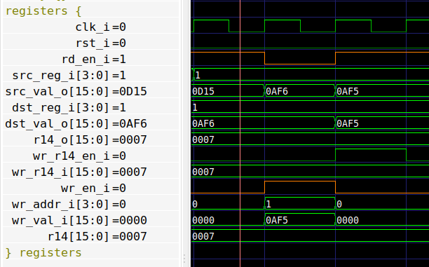

# REGISTERS module

This module contains all the registers in the CPU. It has two read ports
connected to the DECODE stage, and a single write port connected to the EXECUTE
stage.

The only register that is treated in a special way is the processor Status
Register (R14). This is because this registed is usually written to at the end
of each instruction together with any optional register writes.

The Stack Pointer (R13) is treated like a normal register (this is handled in
the DECODE stage). The Program Counter (R15) is not used in the register file;
instead the Program Counter resides entirely within the FETCH stage.


## Interface
The top-level interface of the REGISTERS module is as follows:

```
-- Read interface, connected to DECODE stage
rd_en_i     : in  std_logic;
src_reg_i   : in  std_logic_vector(3 downto 0);
src_val_o   : out std_logic_vector(15 downto 0);
dst_reg_i   : in  std_logic_vector(3 downto 0);
dst_val_o   : out std_logic_vector(15 downto 0);
r14_o       : out std_logic_vector(15 downto 0);

-- Write interface, connected to EXECUTE stage
wr_r14_en_i : in  std_logic;
wr_r14_i    : in  std_logic_vector(15 downto 0);
wr_en_i     : in  std_logic;
wr_addr_i   : in  std_logic_vector(3 downto 0);
wr_val_i    : in  std_logic_vector(15 downto 0)
```


## Operation

The latency is fixed at one clock cycle. There is a read-enable, which means
that the register address signals `src_reg_i` and `dst_reg_i` are only sampled
when `rd_en_i` is asserted.

This module supports Write-Before-Read, which means that special care is needed
when writing to a register currently (or previously) read. Specifically, if a
register is read from and written to in the same clock cycle (i.e. `rd_en_i`
are `wr_en_i` are both asserted, and `wr_addr_i` is equal to one of `src_reg_i`
or `dst_reg_i`) then the value presented on the next clock cycle is the value
just written.

But furthermore, if a register was read in the previous clock cycle, but
`rd_en_i` is now de-asserted, the output value is still updated in case of a
write. This is shown in the diagram below.



Here we see the execution of the :
* In the first clock cycle the DECODE stage reads from register 1.
* In the second clock cycle the result of the read operation (`0AF6`) is
  presented on `src_val_o` and `dst_val_o`. Simultaneously, a write (`0AF5`) is
  being performed to register 1, but no new read is issued.
* Nevertheless, despite the lack of a read request, the outputs are updated
  with the new value just written.

This feature is used during the `MOVE @--R1, @R1` instruction.

Here is another example with a similar behaviour:


This is during execution of the `SUB @R1++, @R1` instruction.


## Implementation

The main part of the implementation is the Dual-Port RAM module
[`dp_ram.vhd`](../sub/dp_ram.vhd). The read-enable is propagated to this
sub-module, but the write-before-read functionality must be handled in this
module.

Additionally, we must have extra circuitry to disable update of the output when
`rd_en_i` is de-asserted.


## Formal verification

### Falling edge

First of all, since the Dual-Port RAM sub-module
[`dp_ram.vhd`](../sub/dp_ram.vhd) uses falling edge, we need to place some
restrictions on the inputs. Specifically, we require that the input signals
only change on the rising clock edge, and not on the falling clock edge.

We do this by sampling the input signals on the falling clock edge and
verifying the value match on the rising clock edge.

```
signal f_falling_rd_en   : std_logic;
signal f_falling_src_reg : std_logic_vector(3 downto 0);
signal f_falling_dst_reg : std_logic_vector(3 downto 0);

p_falling : process (clk_i)
begin
   if falling_edge(clk_i) then
      f_falling_rd_en   <= rd_en_i;
      f_falling_src_reg <= src_reg_i;
      f_falling_dst_reg <= dst_reg_i;
   end if;
end process p_falling;

assume always {not clk_i} |-> {f_falling_rd_en = rd_en_i and
                               f_falling_src_reg = src_reg_i and
                               f_falling_dst_reg = dst_reg_i};
```


### R14
We start by verifying the R14 behaviour. It is important that in the case of
simultaneously asserting `wr_en_i` and `wr_r14_en_i`, the former takes
priority.

```
signal f_write_to_r14 : std_logic;
f_write_to_r14 <= '1' when wr_en_i = '1' and wr_addr_i = 14 else '0';

f_r14_a : assert always {wr_r14_en_i and not f_write_to_r14 and not rst_i} |=>
                        {r14_o = (prev(wr_r14_i) or X"0001")};
f_r14_b : assert always {f_write_to_r14 and not rst_i} |=>
                        {r14_o = (prev(wr_val_i) or X"0001")};
f_r14_c : assert always {rst_i} |=> {r14_o = X"0001"};
```

### Read back

Next we check that a value written can be read back. This is slightly
complicated due to the register banking. I first introduce an arbitrary
constant `c_addr` containing the register address in question.  Then I define
two signals `f_data` and `f_written` containing information about which value
has been written to the address in question. The `f_written` signal is cleared
in case `R14` is updated. Finally, I can check that if the register is read and
not written the correct value is returned.

```
signal c_addr : std_logic_vector(3 downto 0);
attribute anyconst : boolean;
attribute anyconst of c_addr : signal is true;

signal f_data    : std_logic_vector(15 downto 0);
signal f_written : std_logic := '0';

p_written : process (clk_i)
begin
   if rising_edge(clk_i) then
      -- Store value written
      if wr_en_i = '1' and wr_addr_i = c_addr then
         f_data    <= wr_val_i;
         f_written <= '1';
      end if;

      -- Clear in case R14 is updated.
      if (wr_en_i = '1' and wr_addr_i = 14) or wr_r14_en_i = '1' or rst_i = '1' then
         f_written <= '0';
      end if;
   end if;
end process p_written;

f_read_back_src : assert always {f_written = '1' and
                                 src_reg_i = c_addr and
                                 wr_en_i = '0' and
                                 rd_en_i = '1'}
                            |=> {src_val_o = f_data};
f_read_back_dst : assert always {f_written = '1' and
                                 dst_reg_i = c_addr and
                                 wr_en_i = '0' and
                                 rd_en_i = '1'}
                            |=> {dst_val_o = f_data};
```

### Write before read
Now it's time to verify the write-before-read functionality. We test two cases: First when reading and writing in the same clock cycle:

```
f_wbr_src : assert always {wr_en_i = '1' and
                           rd_en_i = '1' and
                           wr_addr_i = src_reg_i}
                      |=> {src_val_o = prev(wr_val_i)};
f_wbr_dst : assert always {wr_en_i = '1' and
                           rd_en_i = '1' and
                           wr_addr_i = dst_reg_i}
                      |=> {dst_val_o = prev(wr_val_i)};
```

And second, when writing in the next cycle without a new read request:
```
f_wbr_stable_src : assert always {rd_en_i = '1';
                                  wr_en_i = '1' and
                                  rd_en_i = '0' and
                                  wr_addr_i = prev(src_reg_i)}
                             |=> {src_val_o = prev(wr_val_i)};
f_wbr_stable_dst : assert always {rd_en_i = '1';
                                  wr_en_i = '1' and
                                  rd_en_i = '0' and
                                  wr_addr_i = prev(dst_reg_i)}
                             |=> {dst_val_o = prev(wr_val_i)};
```

### Output stable when no read

Finally, we verify the output values don't change when read is de-asserted (as
long as no writes are issued):
```
f_stable_src : assert always {rd_en_i = '1';
                              wr_en_i = '0'[*];
                              wr_en_i = '0' and rd_en_i = '0'}
                         |=> {stable(src_val_o)};
f_stable_dst : assert always {rd_en_i = '1';
                              wr_en_i = '0'[*];
                              wr_en_i = '0' and rd_en_i = '0'}
                         |=> {stable(dst_val_o)};
```

